# Complete the Candidate Profile Form

## Introduction

Recruiters need to see a candidate's contact details, application status, CV, and interview history together. In this lab, you will convert the existing Candidate Details region into a form, arrange its items in two columns, and configure file handling.

Estimated Lab Time: 10 minutes

### Objectives

In this lab, you will:

- Add candidate photo columns and load the supplied sample images.
- Configure the Candidate Details form and its primary key.
- Create Candidate Profile and Application Status sub-regions.
- Configure the candidate photo and CV upload/download items.

### Using the Supplied Page 11 Export

The supplied export already contains **Candidate Details**, **Candidate Profile**, **Application Status**, **Application History**, and **Initialize form Candidate Profile**. When working from that page, reuse these components and apply the settings below. Leave **Application History** in place; Lab 2 configures it as **Interview Feedback History**. The export is a starting point: Current Stage is still a text field, Diversity Flag is Display Only, and no save button or DML save process is defined. The page-only export does not establish which shared LOVs exist in the application.

### Downloads

| File | Purpose | Status |
| --- | --- | --- |
| [Candidate sample images](files/tms_candidates_images.sql) | Populate candidate photo BLOBs and metadata | Existing script supplied with this lab |
| [Sample CV instructions](files/sample-candidate-cv.pdf.placeholder.txt) | Prepare a PDF for the CV upload test | Placeholder; supply a real PDF |

## Task 1: Add Candidate Photo Columns

In this task, you will prepare the candidate table to store photos. The **RESUME\_BLOB** column already exists in the workshop schema.

1. Sign in to your APEX workspace. From the workspace home page, click **SQL Workshop**

    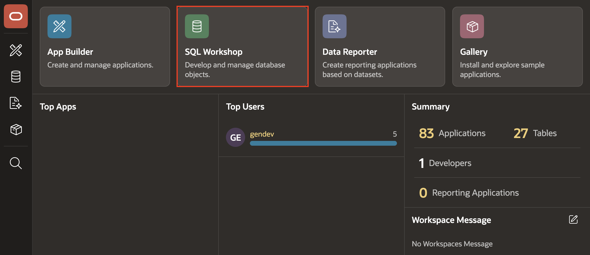

2. Then, select **SQL Commands**.

    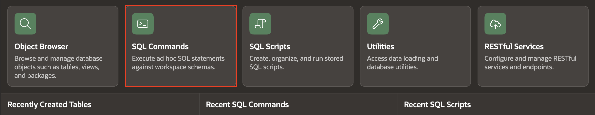

3. Then, run the following statement once. If you have already added these columns, skip this statement.

    ```sql
    <copy>
    ALTER TABLE tms_candidates ADD (
        photo_blob         BLOB,
        photo_mime_type    VARCHAR2(255),
        photo_filename     VARCHAR2(255),
        photo_charset      VARCHAR2(255),
        photo_last_updated DATE
    );
    </copy>
    ```

    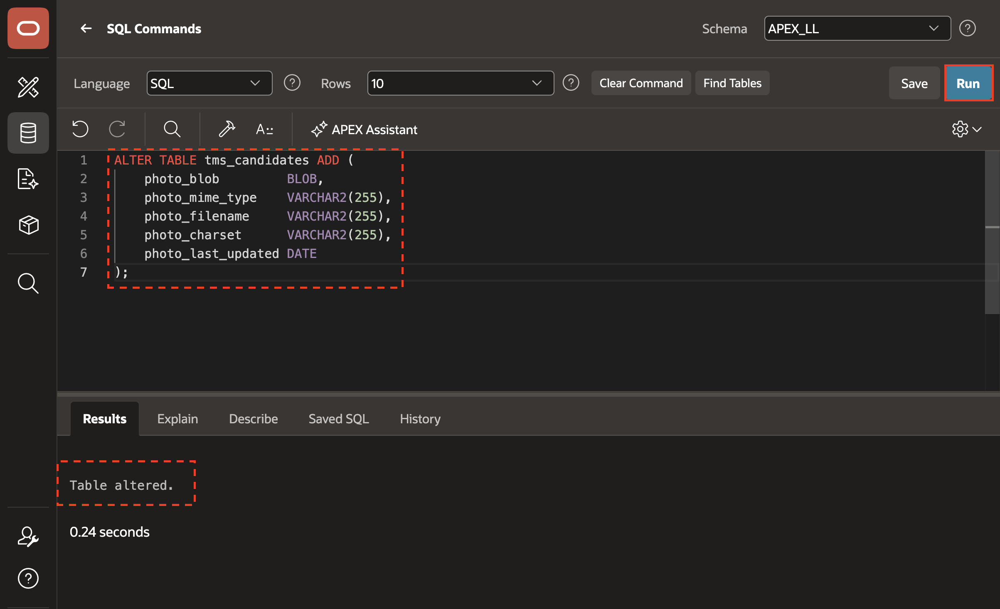

4. Download the [candidate sample image script](files/tms_candidates_images.sql).

5. Navigate to **SQL Workshop > SQL Scripts**.

    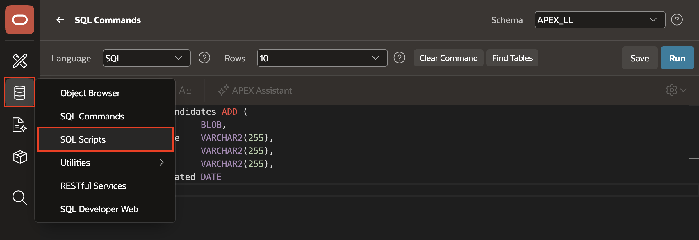

6. Click **Upload**.

    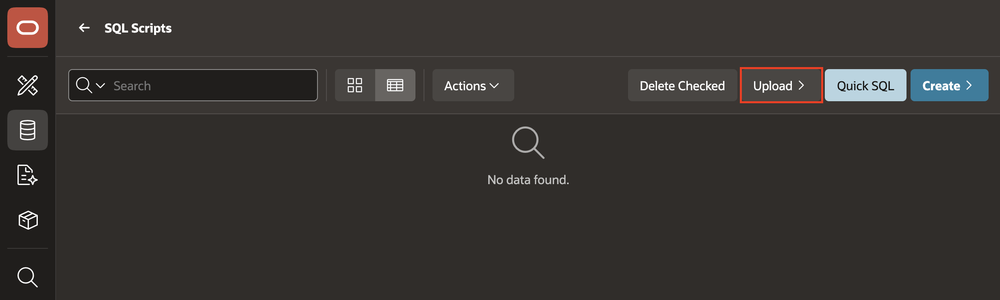

7. In the Upload Script dialog, click **Choose File**.

    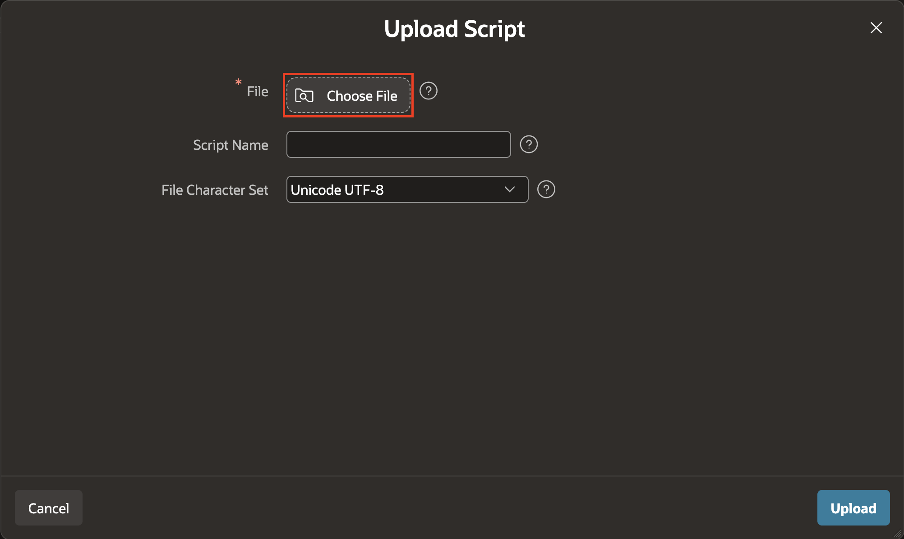

8. Select **tms\_candidates\_images.sql** and click **Open**.

    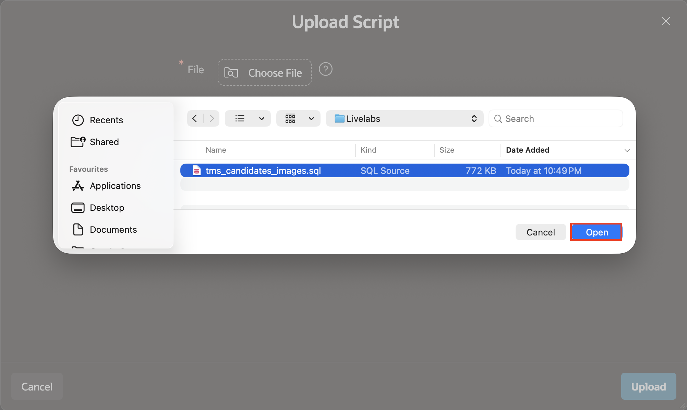

9. Click **Upload** to add the script to SQL Scripts.

10. Open the uploaded **tms\_candidates\_images.sql** script and click the Run icon.

    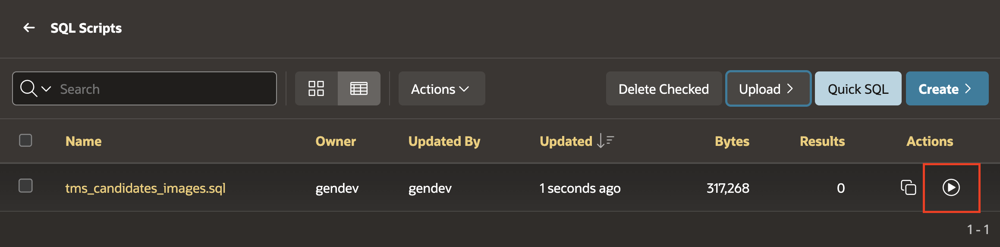

11. Review the script details and click **Run** to confirm execution.

    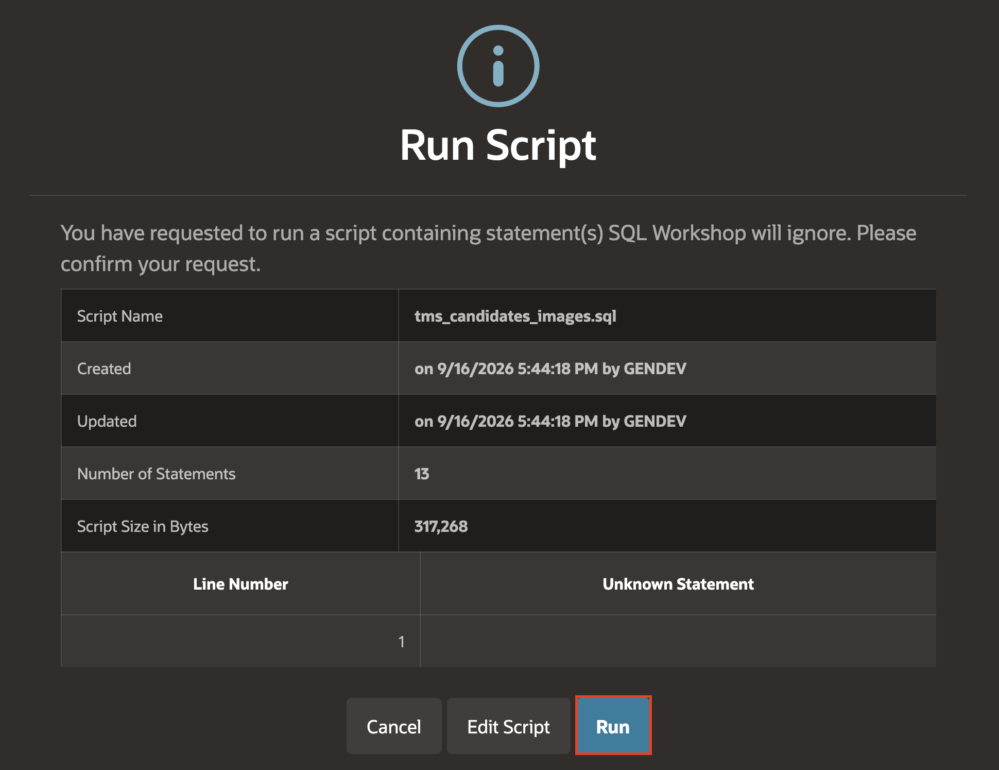

12. Review the results and confirm that all statements completed successfully.

    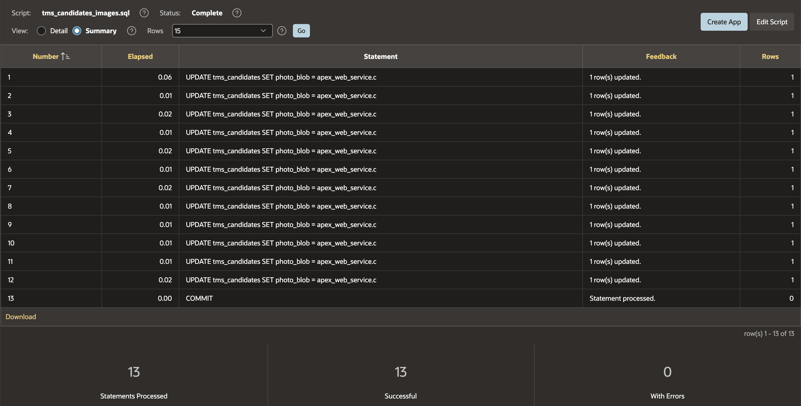

## Task 2: Configure the Candidate Details Form

1. Click **App Builder**.

    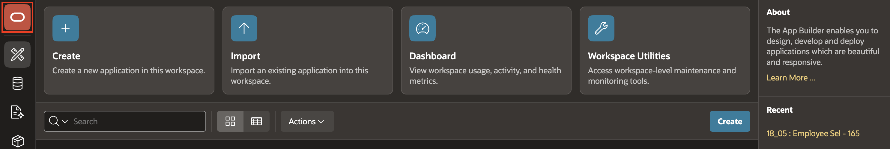

2. Open **Talent Acquisition Portal**.

    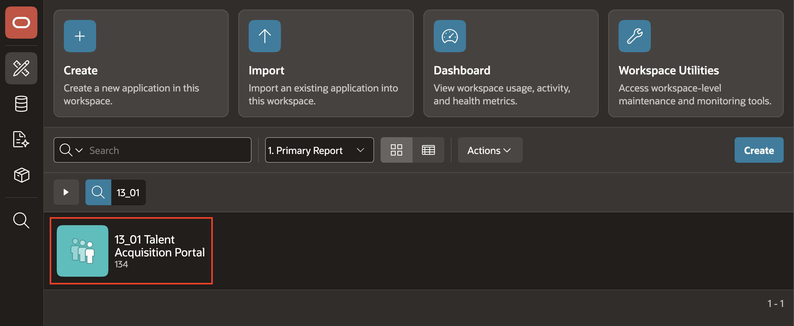

3. Select **Page 11: Candidate Profile**.

    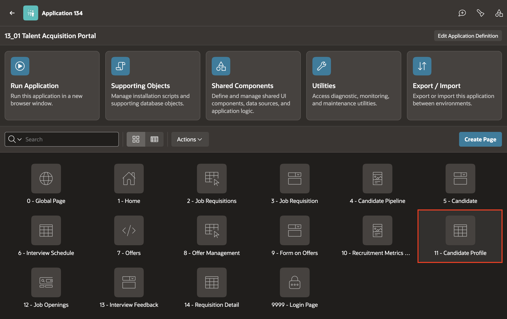

4. In the Rendering tree, locate **P11\_CANDIDATE\_ID**. If you are converting the earlier Static Content region and this item has no form source, delete it before synchronizing the new form items. If you are using the supplied export, keep the existing item: it is already bound to **Candidate Details** and marked as the primary key.

    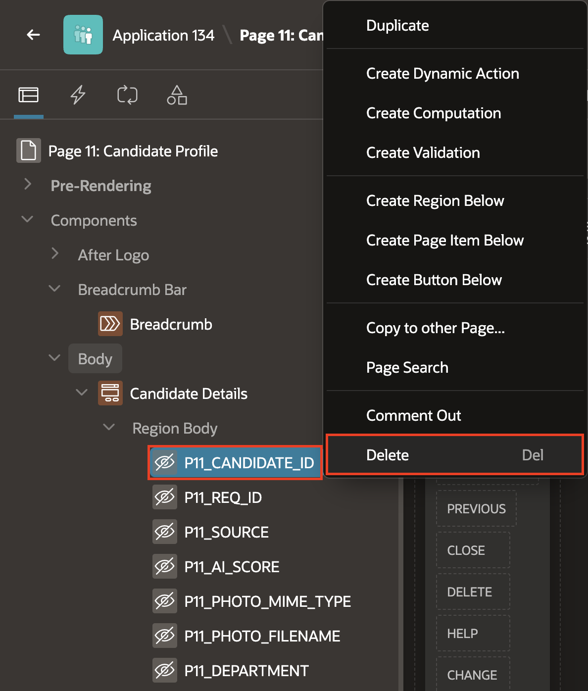

5. Select **Candidate Details** in the Rendering tree. In the Property Editor, enter/select:

    - Identification > Type: **Form**
    - Source > Location: **Local Database**
    - Source > Type: **SQL Query**


6. In the Property Editor:

    - Replace the SQL query with the following:
        ```sql
        <copy>
        SELECT c.candidate_id,
            c.req_id,
            j.title AS requisition,
            d.name AS department,
            c.first_name,
            c.last_name,
            c.email,
            c.phone,
            c.source,
            c.current_stage,
            c.applied_date,
            TRUNC(SYSDATE - c.applied_date) AS days_since_applied,
            c.diversity_flag,
            c.ai_score,
            c.photo_blob,
            c.photo_mime_type,
            c.photo_filename,
            c.resume_blob
        FROM tms_candidates c
        LEFT JOIN tms_job_requisitions r ON c.req_id = r.req_id
        LEFT JOIN tms_jobs j ON r.job_id = j.job_id
        LEFT JOIN tms_departments d ON r.dept_id = d.dept_id
        </copy>
        ```

    - Appearance > Template: **Blank with Attributes**

    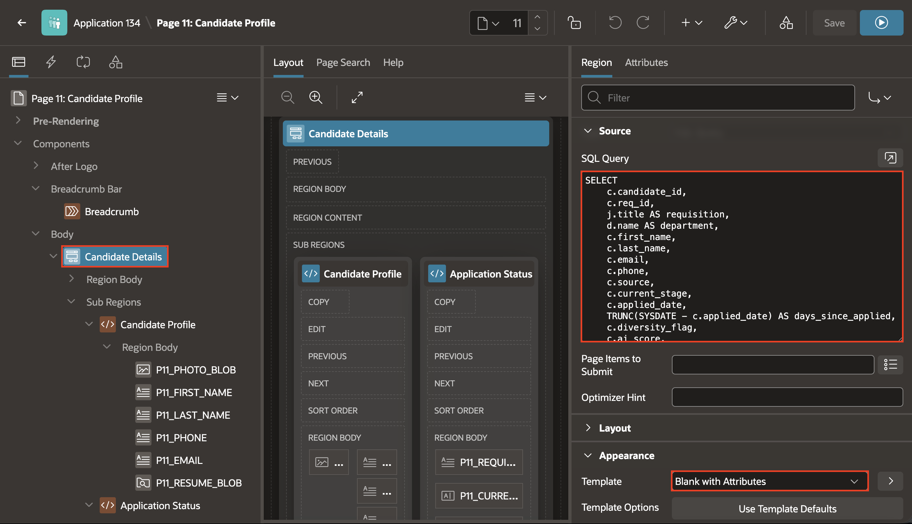

7. Right-click **Candidate Details** and select **Synchronize Page Items** to create missing items. Check that each item uses the matching **Form Region** and **Database Column** source.

8. Select **P11\_CANDIDATE\_ID** and configure:

    | Property | Value |
    | --- | --- |
    | Identification > Type | **Hidden** |
    | Source > Form Region | **Candidate Details** |
    | Source > Column | **CANDIDATE\_ID** |
    | Source > Primary Key | **Yes** |
    | Session State > Storage | **Per Session (Persistent)** |

    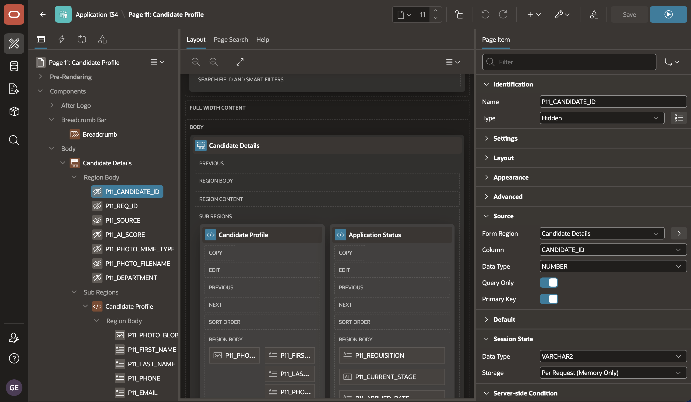

9. In the Rendering tree, expand **Pre-Rendering > Before Header** and select **Initialize form Candidate Profile**, the initialization process included in the export. If it is missing, right-click **Before Header** and select **Create Process**. Set **Identification > Type: Form - Initialization**, **Settings > Form Region: Candidate Details**, and **Execution > Point: Before Header**.

10. Set **Source > Query Only** to **Yes** for **REQUISITION**, **DEPARTMENT**, and **DAYS\_SINCE\_APPLIED**. These values come from joined tables or a calculation and must not be included in candidate updates.

## Task 3: Arrange the Form in Two Columns

In this task, you will create two sub-regions under **Candidate Details**. The left column will display the candidate's profile and CV. The right column will display the application status.

*Note: Both sub-regions already exist in the supplied export. Select them when following the configuration steps below instead of creating duplicates. Move P11\_SOURCE into Candidate Profile and change it to Display Only as shown; the exported item is hidden under Candidate Details.*

1. In Page Designer, click the **Rendering** tab in the left pane.

2. In the Rendering tree, right-click **Candidate Details** and select **Create Sub Region**.

    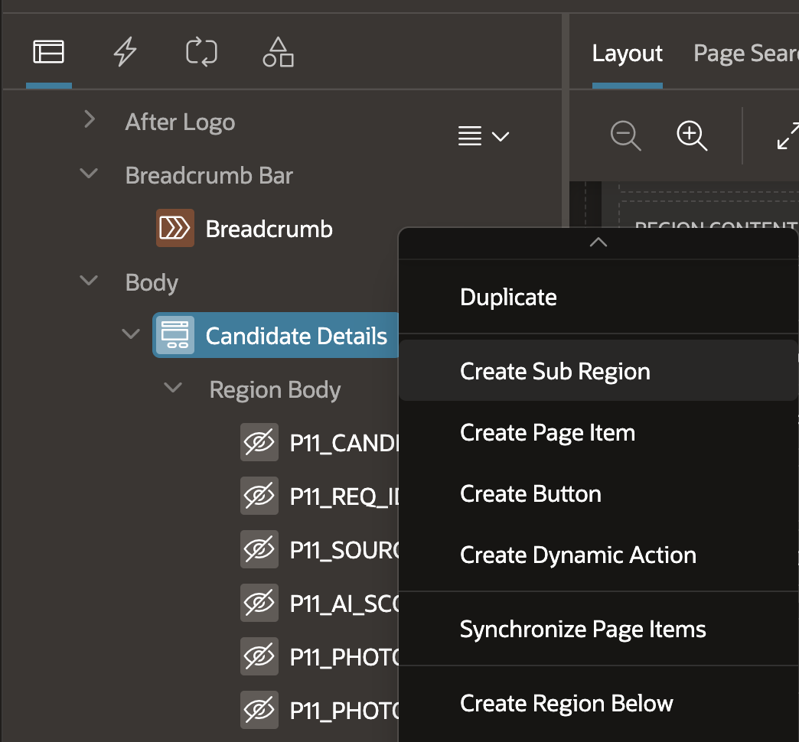

3. Select the new region and enter/select the following in the Property Editor:

    - Under Identification:

        - Title: **Candidate Profile**
        - Type: **Static Content**

    - Under Layout:

        - Parent Region: **Candidate Details**
        - Sequence: **10**
        - Start New Row: **Toggle ON**
        - Column Span: **6**

    - Appearance > Template: **Standard**

    The Candidate Profile region will occupy half of the available width. You will place the Application Status region beside it.

4. In the Rendering tree, select **P11\_PHOTO\_BLOB** and enter/select the following in the Property Editor:

    - Under Layout:
        - Region: **Candidate Profile**
        - Sequence: **10**

        The item now appears under **Candidate Profile** in the Rendering tree. You will configure its image settings in Task 4.

    *Note: Layout > Region controls where the item appears. Keep Source > Form Region set to Candidate Details so that the item remains associated with the form.*

    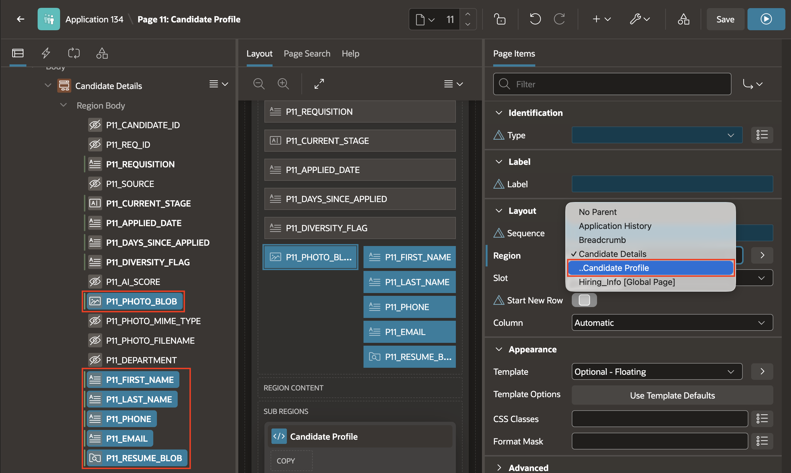

5. Similarly, select each of the following items in the Rendering tree and update its settings in the Property Editor. For all items, set **Layout > Region: Candidate Profile** and **Layout > Start New Row: Toggle ON**.

    | Item | Identification > Type | Layout > Sequence | Source > Query Only |
    | --- | --- | --- | --- |
    | P11\_FIRST\_NAME | Display Only | 20 | Toggle ON |
    | P11\_LAST\_NAME | Display Only | 30 | Toggle ON |
    | P11\_EMAIL | Display Only | 40 | Toggle ON |
    | P11\_PHONE | Display Only | 50 | Toggle ON |
    | P11\_SOURCE | Display Only | 60 | Toggle ON |
    | P11\_RESUME\_BLOB | File Upload | 80 | Toggle OFF |

    **Display Only** shows a value without an input field. **Query Only** excludes the value from the form's update operation. You will configure the CV storage settings in Task 4.

6. Right-click **Candidate Details** and select **Create Sub Region**.

7. Select the new region and enter/select the following in the Property Editor:

    - Under Identification:
        - Title: **Application Status**
        - Type: **Static Content**

    - Under Layout:
        - Parent Region: **Candidate Details**
        - Start New Row: **Toggle OFF**

    Setting **Start New Row** to **OFF** places Application Status beside Candidate Profile. Each region occupies six columns.

    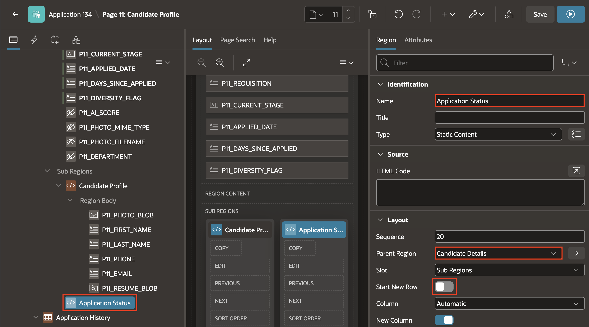

8. In the Rendering tree, select **P11\_CURRENT\_STAGE** and enter/select the following in the Property Editor:

    - Identification > Type: **Text Field**

    - Under Layout:
        - Region: **Application Status**

    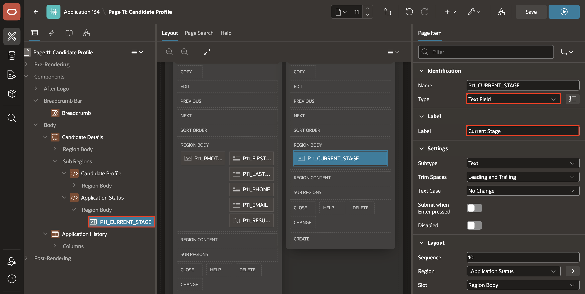

9. Similarly, select each of the following items and update the settings shown below. For all items, set **Layout > Region: Application Status** and **Layout > Start New Row: Toggle ON**.

    | Item | Identification > Type | Layout > Sequence | Source > Query Only | Additional Settings |
    | --- | --- | --- | --- | --- |
    | P11\_REQUISITION | Display Only | 10 | Toggle ON | None |
    | P11\_APPLIED\_DATE | Display Only | 30 | Toggle ON | Appearance > Format Mask: **DD-MON-YYYY** |
    | P11\_DAYS\_SINCE\_APPLIED | Display Only | 40 | Toggle ON | Label > Label: **Days Since Applied** |
    | P11\_DIVERSITY\_FLAG | Display Only | 50 | Toggle ON | Label > Label: **Diversity Flag** |

    The form query from Task 2 calculates **Days Since Applied**.

    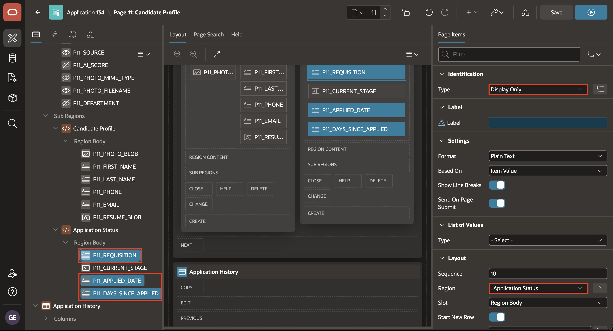

    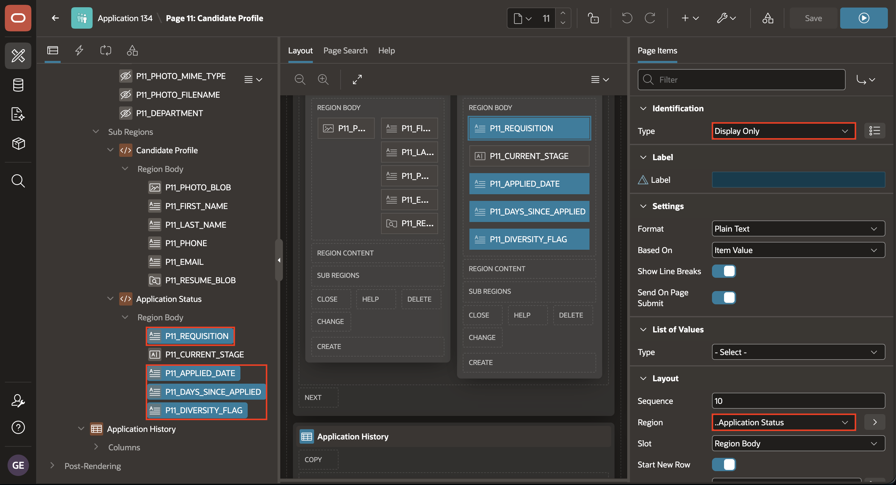

10. Select each of the following remaining items and set **Identification > Type: Hidden** and **Source > Query Only: Toggle ON**:

    - **P11\_REQ\_ID**
    - **P11\_SOURCE**
    - **P11\_DEPARTMENT**
    - **P11\_AI\_SCORE**
    - **P11\_PHOTO\_MIME\_TYPE**
    - **P11\_PHOTO\_FILENAME**

    Keep **P11\_CANDIDATE\_ID** as the hidden primary-key item configured in Task 2.

    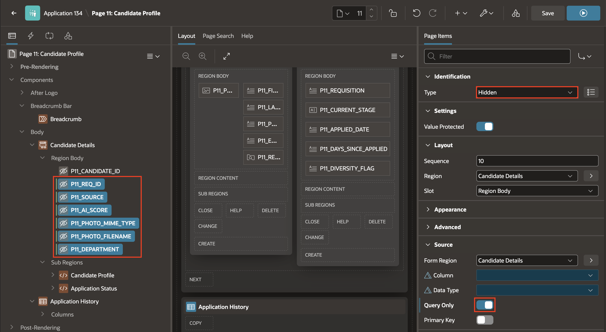

11. Click **Save**.

    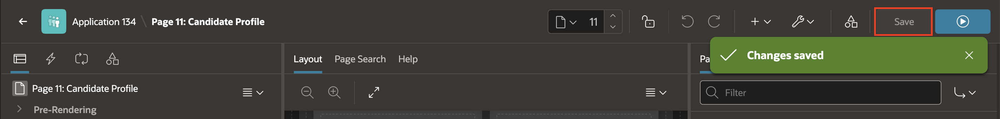

## Task 4: Configure the Photo and Resume Items

In this task, you will display the candidate's photo and configure the Resume item for CV upload and download.

1. In the Rendering tree, select **P11\_PHOTO\_BLOB** and enter/select the following in the Property Editor:

    - Identification > Type: **Display Image**
    - Label > Label: **Photo**
    - Layout > Region: **Candidate Profile**

    - Under Settings:
        - Based On: **BLOB Column specified in Item Source**
        - MIME Type Column: **PHOTO\_MIME\_TYPE**
        - Filename Column: **PHOTO\_FILENAME**

    - Under Source:
        - Form Region: **Candidate Details**
        - Column: **PHOTO\_BLOB**
        - Query Only: **Toggle ON**

    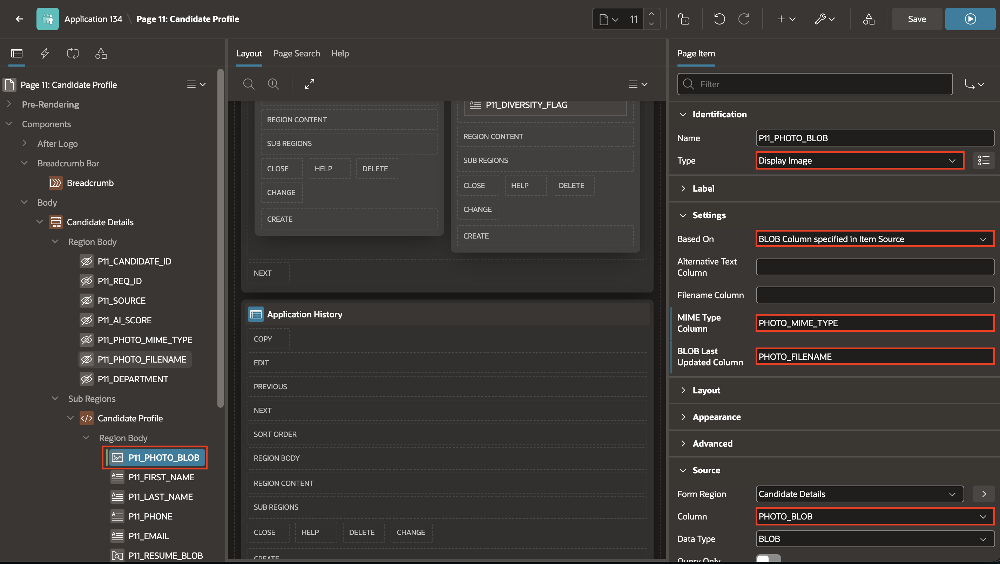

2. Select **P11\_RESUME\_BLOB** and enter/select the following:

    - Identification > Type: **File Upload**
    - Label > Label: **Resume**
    - Layout > Region: **Candidate Profile**

    - Under Display:
        - Display As: **Inline File Browse**
        - Display Download Link: **Toggle ON**
        - Download Link Text: **Download CV**
        - Content Disposition: **Attachment**

    - Storage > Type: **BLOB column specified in Item Source**

    Leave the optional MIME type, filename, character set, and last-updated column mappings empty. The supplied candidate table does not include separate resume metadata columns.

    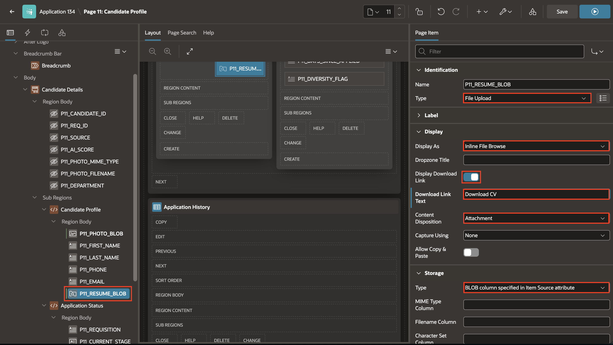

3. Click **Save**.

    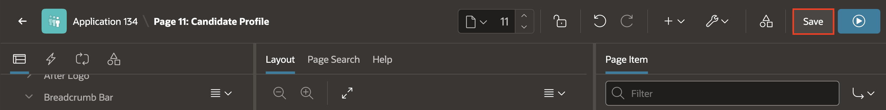

## Task 5: Run the Candidate Profile Page

1. Run the **Talent Acquisition Portal** application.

    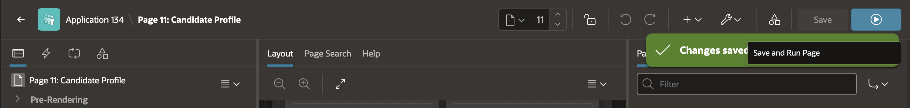

2. Select **Candidate Pipeline** from the Home Page.

    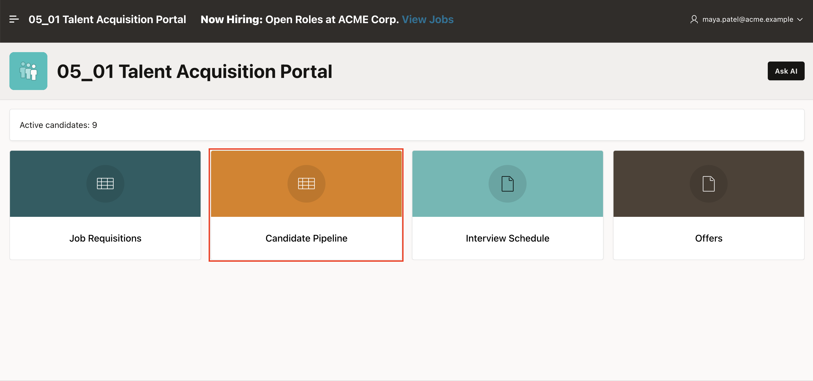

3. Navigate to the **Interactive Report** available in the **Candidate Pipeline** page and select an existing candidate from the candidate list.

    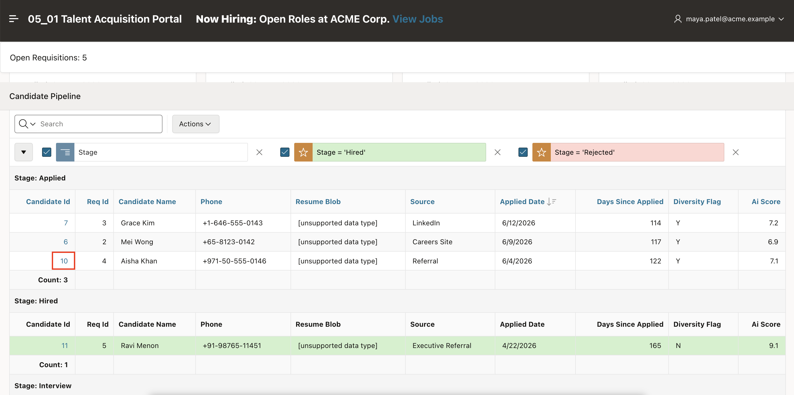

    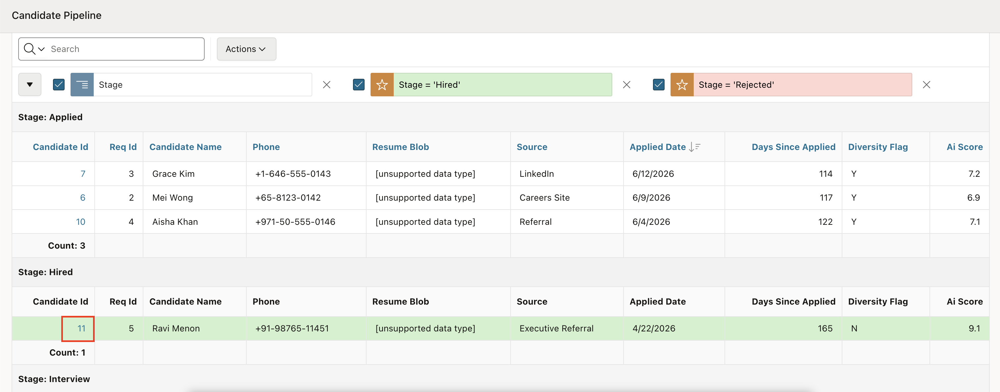

4. Confirm that **Candidate Profile** appears on the left and **Application Status** appears on the right. Check that the photo and candidate details display correctly.

5. Click **Download CV** next to the Resume item and open the downloaded file. Confirm that it contains the PDF you uploaded.

    *Note: The download link appears for a saved CV. Without a stored filename, the downloaded file may have a generated name.*

    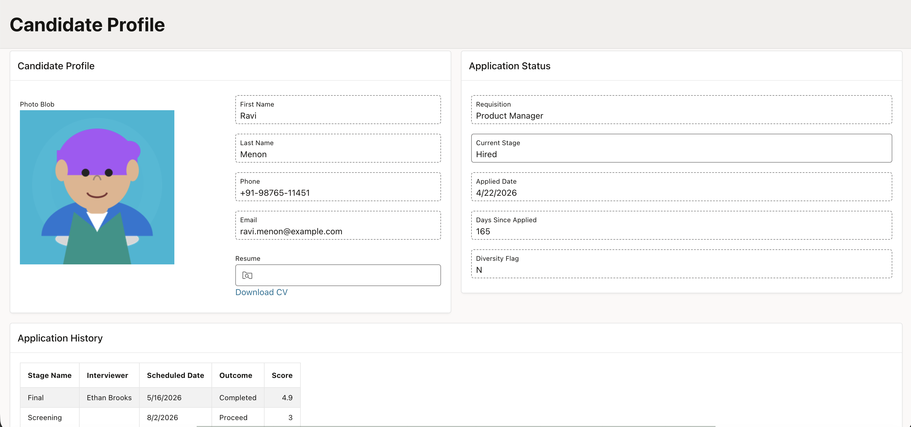

## Summary

In this lab, you arranged the Candidate Profile form into two columns, configured the photo and Resume items, and enabled saving changes and downloading the CV. Lab 2 configures the existing Application History region to display interview feedback.

You may now **proceed to the next lab**.

## Learn More

- [Oracle APEX 26.1: Configuring File Upload to a BLOB Column](https://docs.oracle.com/en/database/oracle/apex/26.1/apxdc/configuring-file-upload-blob-column.html)
- [Oracle APEX 26.1: Controlling File Upload Item Behavior](https://docs.oracle.com/en/database/oracle/apex/26.1/apxdc/controlling-file-upload-item-behavior.html)
- [Oracle APEX 26.1: Saving Changes with a Page Process](https://docs.oracle.com/en/database/oracle/apex/26.1/apxdc/saving-changes-page-process.html)

## Acknowledgements

- **Author** - Roopesh Thokala, Principal Product Manager
- **Last Updated By/Date** - September, 2026
