# Add Pages to the Application

## Introduction

In this hands-on lab, you will create a page for collecting new appointment requests. You will create pages for managing doctor appointments, incorporating workflows, task lists, and feedback.

### Objectives

In this lab, you will learn how to
  - Create the New Appointments pages
  - Create the Patient Tasks page
  - Create the Doctors Task page
  - Modify the Task Details page
  - Create the Feedback page and View appointment workflows page

Estimated Time: 20 minutes

### Prerequisites
1. Access to Oracle APEX.
2. Ensure that you have completed the Previous labs.

## Task 1: Create the New Appointments Page

Now that the Workflow is created let us create the Page that the Hospital Staff will use to Submit a New Appointment.

1. Navigate to your application by clicking on **Application ID <number>**. Alternatively, you can also navigate by clicking the App Builder icon for your workspace and selecting **Doctor Appointments Made Easy!** Application.

    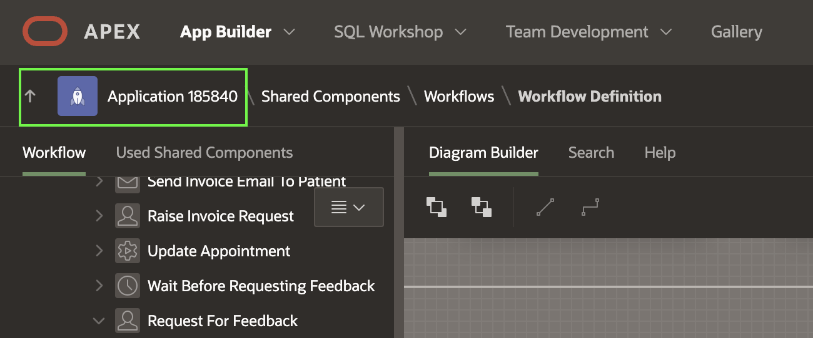

2. Click **Create Page**.
    

3. For Create a Page:
   - select Page Type - under **Component** and then select **Blank Page**.
    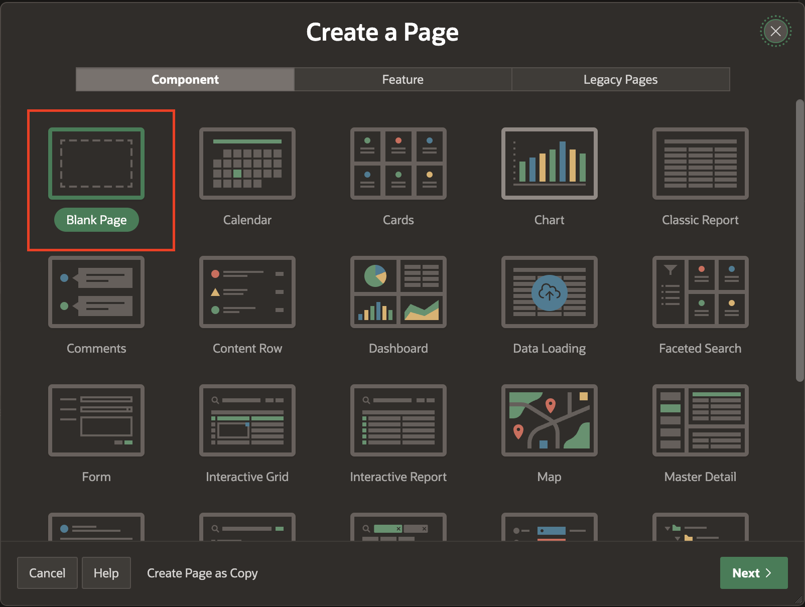

4. For Page Attributes, enter the following:
    - For Page Name, enter **New Appointment**  
    - Under **Navigation**
        - For **Breadcrumb**, Set it to **Yes**.
        - For **Breadcrumb Parent Entry** select **Home (Page 1)**
    Click **Create Page**.

    

5. In the **Page Designer**, right click on body and click **Create Region**.

    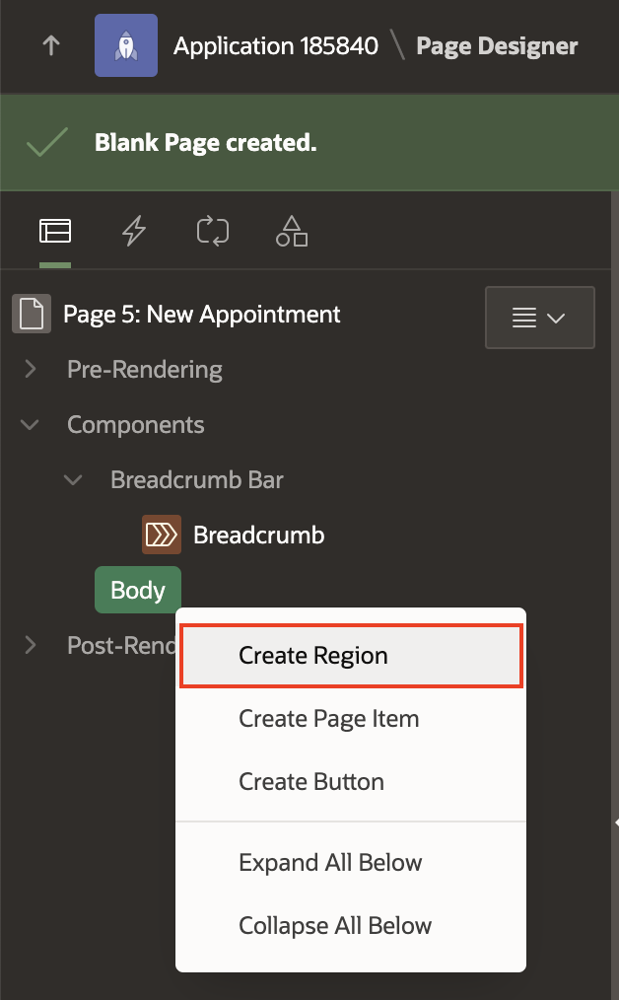

6. In the Property Editor, under Identification, Change the Title to **Patient Appointment Details**.

     

7. In the rendering pane, right click on **Patient Appointment details** and then click **Create Page Item**.

      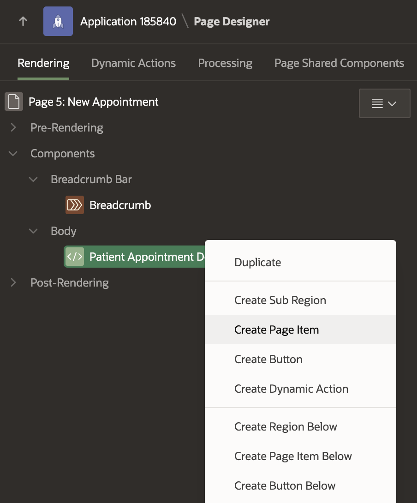

8. Select the newly created item in the Rendering Tree, and then in the property editor, do the following changes.
    - Under Identification,
        - Change the **Name** to **P5_NAME**
        - Set **Type** as **Text Field**

    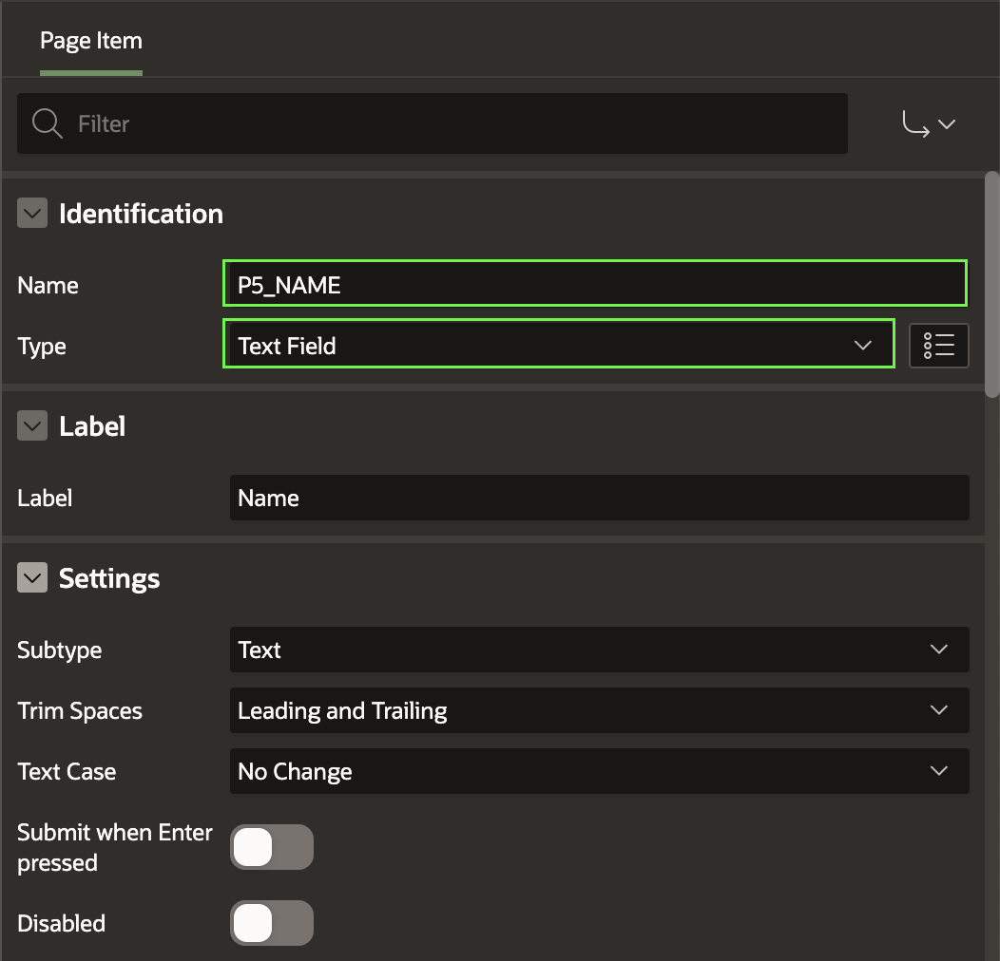

9. Similarly create the Items **P5\_EMAIL**, **P5\_DESC**, **P5\_APPT\_DATE**, **P5\_DOC** and **P5\_AGE** under **Patient Appointment details** Region.

10. For **P5\_EMAIL**, in the property editor,
    - set the type as **Text Field**
    - under settings,
        - change the **Subtype** to **E-Mail**.

    

11. For **P5_DESC**, in the property Editor, perform the following changes.
      - Under Identification,
          - Change the name to **P5_DESC**
          - Set Type as **Select List**
      - Change the label to **Problem**.
      - Under List of Values,
          - Set the **Type** as **Static Values**.
          - For **Static Values**, select **Display1,Display2** and then enter the following under Display and Return.

          | Display Value |  Return Value  |
          | --- |  --- |
          | Psychiatric | PSYCHIATRY |
          | Cancer | ONCOLOGY |
          | ENT | ENT |
          | Gastroenteric | GASTRO |
          | Cardiac | CARDIOLOGY |
          | General | GENERAL |

    

12. For **P5\_APPT\_DATE**, in the property Editor perform the following changes.
      - Under Identification,
          - Set Type as **Date Picker**
      - Set the Label as **Appointment Date**
      - Under Appearance, set the Format Mask as **DD-MON-YYYY HH24:MI:SS**

      

13. For the **P5_DOC** Page Item, In the property editor, perform the following steps.
      - Under Identification,
          - specify the type as **Popup LOV**
      - Set the Label as **Doctor**
      - Under List of Values,
          - Set the **Type** as **SQL Query** and then specify the **List Of Values** using the following SQL Query
          ```
          <copy>
            select dname from doctor where specialization = :P5_DESC
          </copy>
          ```
      - Under **Cascading List of Values**, Set the Parent Item(s) as **P5\_DESC** using the Item Picker.
    

14. Similarly, create **P5_AGE** as **Text field**.

15. Now, right click on **Patient Appointment Details** and click **Create Button**.

  

16. Select the newly created button, and then in the property editor, do the following changes.
      - Under Identification, Set the name as **Submit**.
      - Under Layout, for Position, Select **Create**.
      - Under Appearance, set **Hot** to **Yes**.

  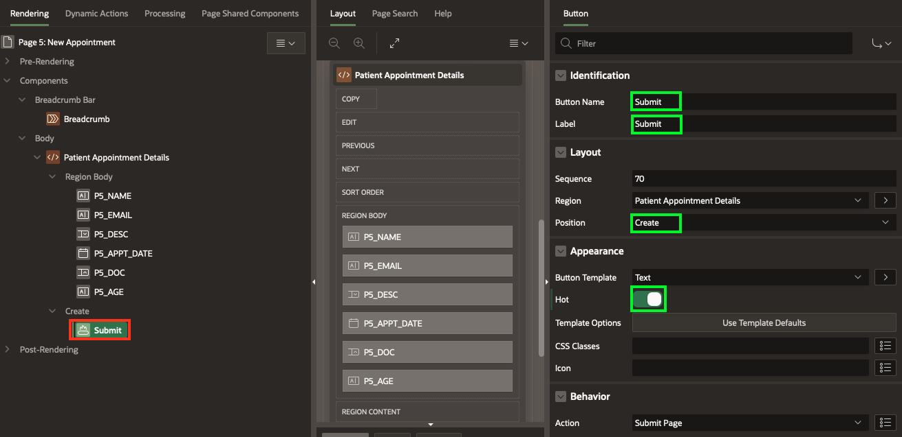


## Task 2: Create and Configure Page Process

1. In the **Left Pane**, navigate to the **Processing Tab**.

2. In the **Processing Tab**, right click on **Processing** and click **Create Process**.

  

3. Select the newly created Page Process, and then in the property editor, do the following changes.
      - Under Identification,
          - Set the **Name** as **Doctor Appointment Workflow**.
          - Set the **Type** as **Workflow**.
      - Under Settings,
          - Set the **Type** as **Start**
          - Set the **Definition** as **Doctors Appointment**.
          - For **Details Primary Key**, select **P5_DOC**.
      - For Success message, enter **Appointment Submitted Successfully!**.

      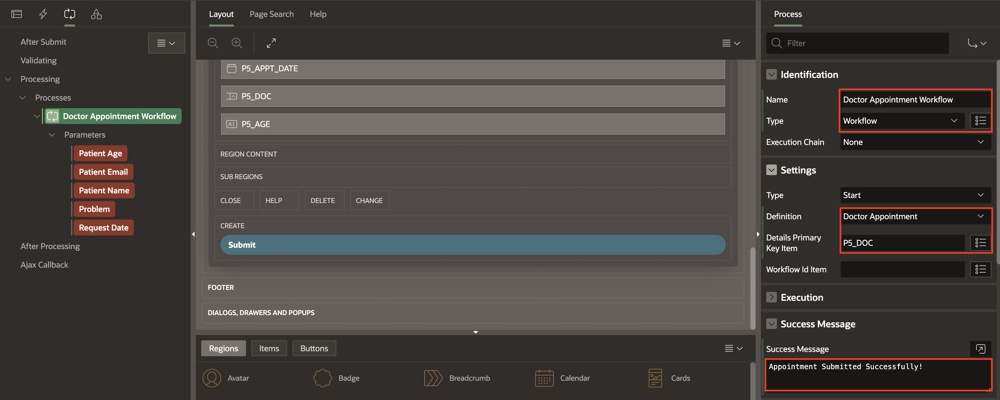


4. Now, set Parameters for the Workflow Page Process. Under **Submit Appointment Workflow** in the Processing section, Click on **Patient Age** and in the **Property Editor**,
    - under Value, Set type as **Item** and **Item** value to **P5_AGE**
      

5. Similarly, Set the remaining parameters under **Submit Appointment Workflow** as follows:
    - Set **Patient Email** as Item **P5\_EMAIL**
    - Set **Patient Name** as Item **P5\_NAME**
    - Set **Problem** as Item **P5\_DESC**
    - Set **Request Date** as Item **P5\_APPT\_DATE**

6. Click **Save** to save the changes.


## Task 3: Creating the Patient and Doctor Tasks Page

Our application has two entry points for Patients. First, to confirm an invoice request. Second, to provide feedback. For this, we need to create a Unified Task List for Patients to act on.

Go to the Application Home and click on Create Page. In the Create Page Wizard, select Unified Task List.

1. Click **+ (Plus) Icon** on the right-above corner of the page designer. Then select **Page** from the drop-down.

  

2. In the **Create a Page** dialog, Under **Component**, Select **Unified Task List** and click **Next**

   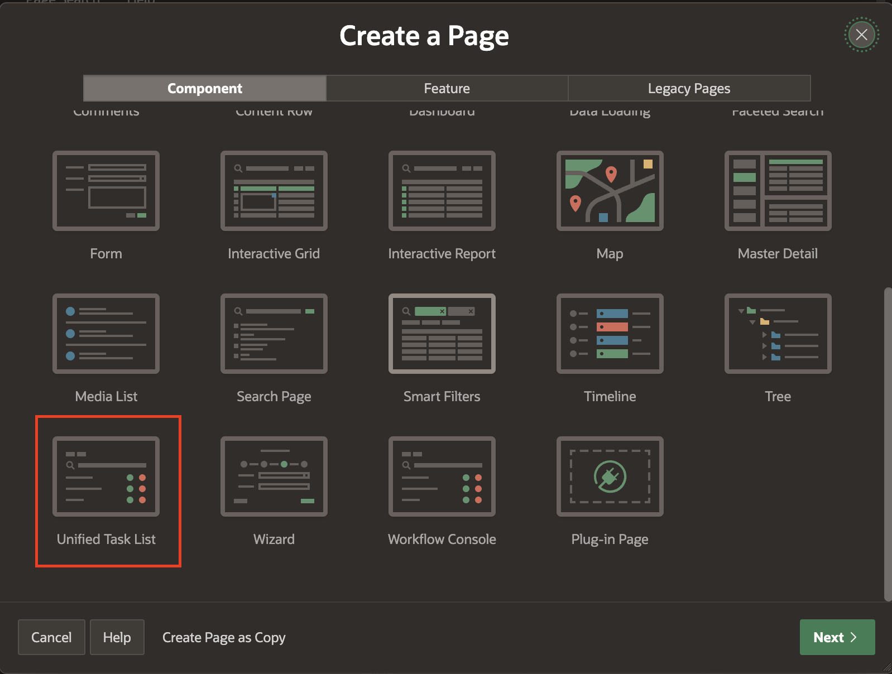

3. Specify the following page attributes:

    - For Page Number - Type 6

    - For Name - Type **Patient Tasks**

    - For Report Context - Select **My Tasks**

    - For Breadcrumb, set it to **Yes**.

    - For **Breadcrumb Parent Entry**, Set it to **Home (Page 1)**.,

    Click **Create Page**. A unified Task List page was created.

       

4. Our application has 1 entry point for Doctors. Doctors need to log in to approve or reject appointment requests. For this, we will create a Doctor Tasks page. This will also be a Unified Task List page for Doctors to act on the tasks assigned to them.

5. To create another Unified Task list page, Again Click Application ID on the top left corner of the page designer. Application Home page appears.

6. Click **Create Page** button. Create Application wizard appears.

7. Under Components, Select Unified Task List and click **Next**

    

8. Specify the following page attributes:

    - For Page Number - Type 7

    - For Name - Type **Doctor Tasks**

    - For Report Context - Select **My Tasks**

    Click **Create Page**. A unified Task List page was created.

    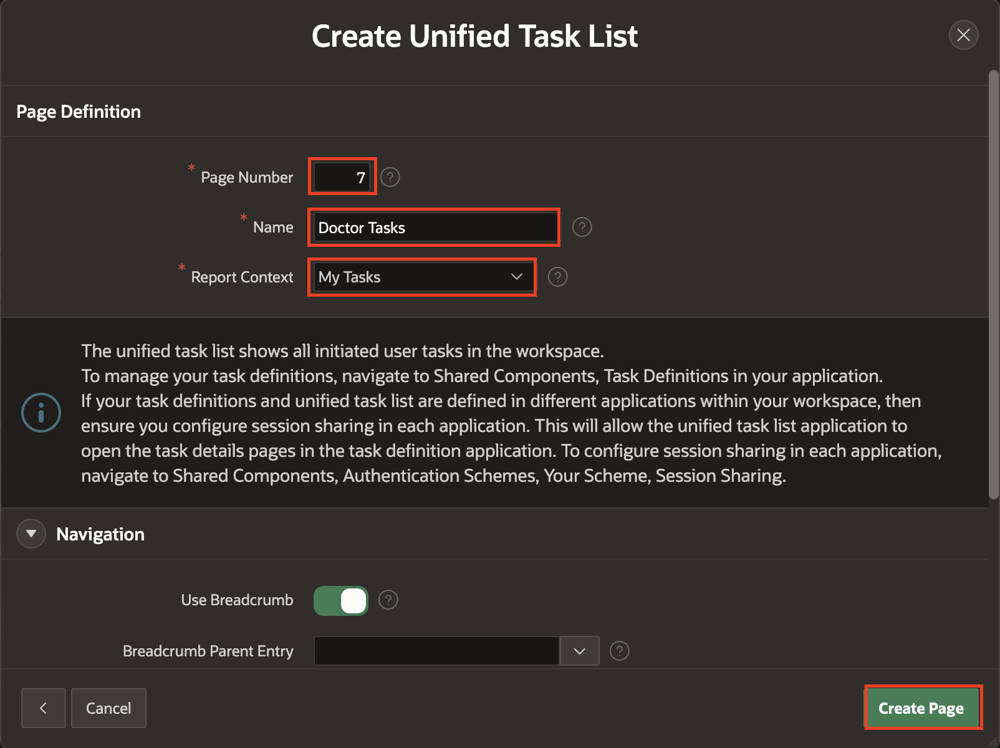

## Task 4: Modify the 3 Task Details Pages

Our Application has 3 Task Definitions -  Appointment Request, Invoice Request, and Feedback Request. For each of them, we had generated a Task Details page. In this task, we will rename the Pages so that they appear more meaningful in the Application.

1. In the **Doctors Appointment Made Easy!** application, navigate to **Shared Components** and select **Task Definitions**.

  

2. Under the **Task Definitions** page, Click on Appointment Request.

  

3. In the **Task Definition Editor**, note the page number in the Task Details URL (f?p=&APP\_ID.:2:&SESSION.::&DEBUG.:RP,2:P2\_TASK\_ID:&TASK\_ID.). This points to Page 2.

  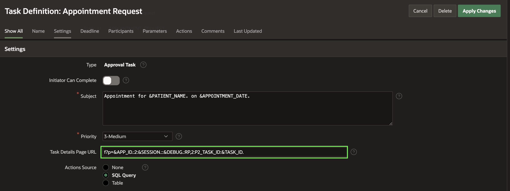

4. Navigate to your application home page and click **Page 2**.

  

5. Now, change the **Page Name** and **Title** of Page 2 to **Appointment Request Details**.

  

6. Click **Save** to save your changes.

7. You now need to change the Invoice Request Details Page.

8. Navigate to the **Invoice Request** Task Definition from Shared Components and similarly check the page number for the Task Details. The **Invoice Request** Task Definition points to Page 3.

9. Navigate to your Application home page and click **Page 3**.

10. Now, change the **Page Name** and **Title** of Page 3 to **Invoice Details**.

  

11. Notice that the rendering region has a **Developer Information** region in the Invoice Details Page. Right-click on the **Developer Information** region and click **Delete**.

  

12. In the rendering Tree, click **Details** region and then modify the Title of **Details Classic Report** region to **View Invoice**.

  

*Note: Developer Information region is autogenerated for Action Tasks (non-approval). This can be removed/customized depending on the application use-case.*

13. Click the **Save** Button to save your changes.

14. Navigate to the **Feedback Request** Task Definition from Shared Components and similarly check the page number for the Task Details. The **Feedback Request** Task Definition points to Page 4.

15. Navigate to your Application home page and click **Page 4**. And then, change the **Page Name** and **Title** of Page 4 to **Feedback Details**.

  

16. Notice there in the rendering region, there is a **Developer Information** region in the Feedback Details Page. Right-click on the **Developer Information** region and click **Delete**.

  

17. In the rendering Tree, click **Details** region and then modify the Title of **Details Classic Report** region to **View Appointment Details**.

  

18. In the Details Page, the patient should be able to fill out a Feedback form and submit it. On submission it will create an entry in the **PATIENT_FEEDBACK** table for the particular doctor. We will customize the Feedback Details Page as follows.

19. In the rendering tree, right click on **View Appointment Details** and click **Create Region Below**.

  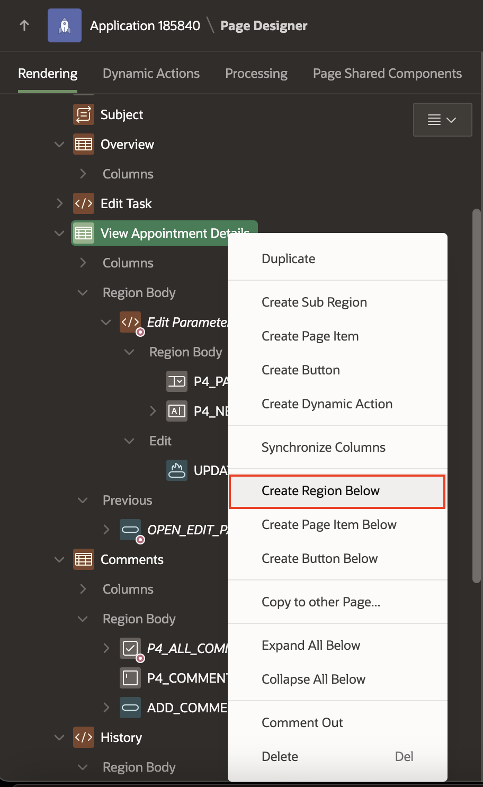

20. Select the newly created region in the Rendering Tree, and then in the property editor, do the following changes.
    - Under Identification,
        - Change the title to **Your Feedback**
        - Set Type as **Form**
    - Under Source,
        - Set **Table** as **APPOINTMENT**.
        - For Where Clause, set it as Below
          ```
          <copy>
          booking_id = :P4_BOOKING_ID
          </copy>
          ```
    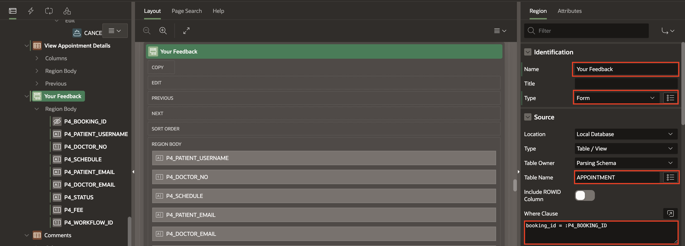

21. In the Rendering Tree, select the Page Items **P4\_FEE** and **P4\_WORKFLOW\_ID** and then change the Identification Type to **Hidden** in the Property Editor.

  

22. In the rendering Tree, select **P4_SCHEDULE** and then in the property editor, under **Appearance**, set format mask to **DD-MON-YYYY HH24:MI:SS**.

   

23. Now, create two new page items under the **Your Feedback** region.

24. In the Rendering tree, right click on **Your Feedback** or **Region Body** under that and click **Create Page Item**.

  

25. Select the newly created page item in the Rendering Tree, and then in the property editor, do the following changes.
    - Under Identification,
        - Change the name to **P4_RATING**
        - Set Type as **Radio Group**
    - Under List of Values,
        - For Type, select **Static Values**
        - For **Static Values**, select **Display1,Display2** and then enter the following under Display and Return.

        | Display Value |  Return Value  |
        | --- |  --- |
        | Excellent | 1 |
        | Good | 2 |
        | Satisfactory | 3 |
        | Unsatisfactory | 4 |

    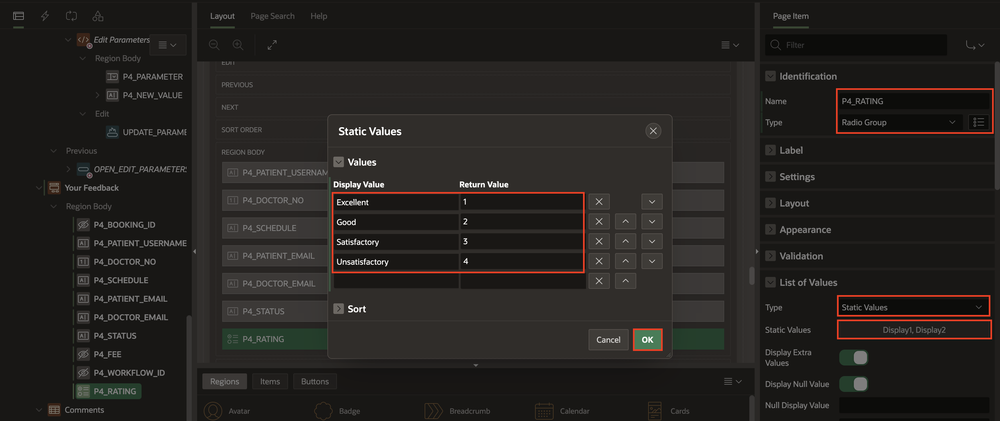

26. Similarly, create a new item **P4_FEEDBACK** and set the type as **Rich Text Editor**.

    

27. Click **Save** to save the changes.

28. In the Pre-Rendering section, add a new Process above the **Initialize Form Feedback Details** Process and name it **Populate Booking Details in Feedback Form**.

29. Select the **Populate Booking Details** and in the Property Editor, set the Process Type as **Execute Code** and enter the following code in the PL/SQL Code section.

    ```
    <copy>
    begin

    select booking_id into :P4_BOOKING_ID
    from appointment where booking_id = (select
         param_value
    from apex_task_parameters
    where task_id = :P4_TASK_ID and param_static_id = 'BOOKING_ID');

    end;
    </copy>
    ```

    

30. In the **Left Pane**, navigate to the **Processing Tab**.

31. In the **Processing Tab**, add a new Process after the **Claim process** and name the newly created process as **Save Feedback**.

32. In the Property editor, set the type as **Execute Code**, and then in the PL/SQL section, enter the following.

    ```
    <copy>
    begin
      insert into patient_feedback (
          patient_name,
          doctor_no,
          appointment,
          feedback,
          rating,
          created_at,
          updated_at)
      values
          (:P4_PATIENT_USERNAME,
          :P4_DOCTOR_NO,
          to_timestamp_tz(:P4_SCHEDULE,'DD-MON-YYYY HH24:MI:SS'),
          :P4_FEEDBACK,
          :P4_RATING,
          systimestamp,
          systimestamp);
    end;
    </copy>
    ```

    

33. In Server Side Condition, set **When Button Pressed** as **COMPLETE**.

    

34. Click **Save** to save the changes.


## Task 5: Create the Patient Appointments And Feedbacks Page

Now, you need to create a View Only page where patients can log in to view their appointments and the feedback they have left so far.

1. Click **+ (Plus) Icon** on the right-above corner of the page designer. Then select **Page** from the drop-down.

    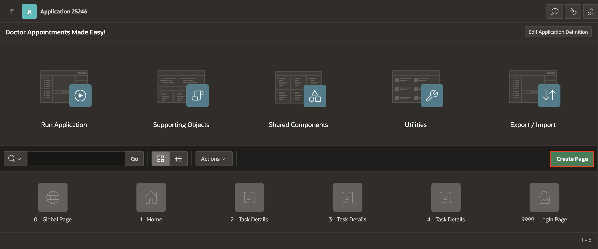

2. In the **Create a Page** dialog, Under **Component**, Select **Blank Page** and click **Next**

   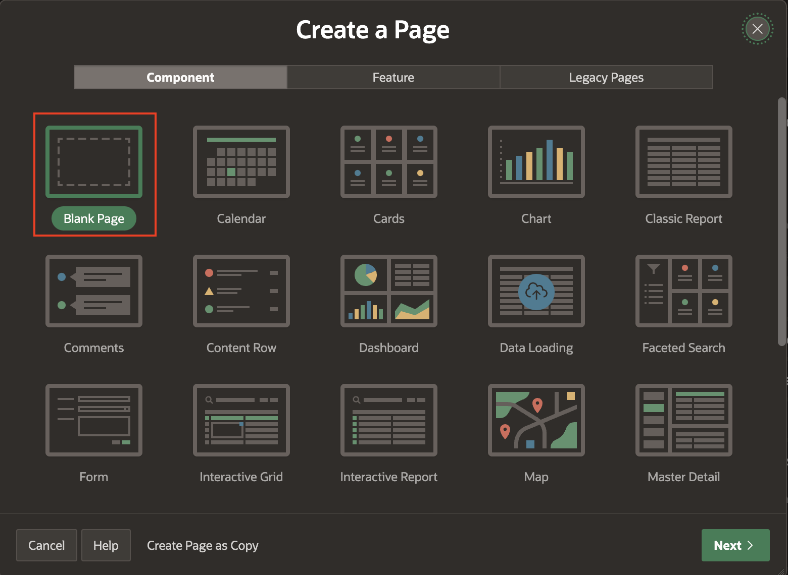

3. Specify the following page attributes:

    - For Page Number - Type 8

    - For Name - Type **Patient Appointments And Feedbacks**

    - For **Breadcrumb Parent Entry**, Set it to **Home (Page 1)**.,

    Click **Create Page**. A unified Task List page was created.

       

4. In Page Designer of the newly created page, right-click on Body and click **Create Region**.

  

5. In the new Region, go to Property Editor and change the name to Appointments. Change the Type to Comments (under Theme Components).
  - Under Identification,
      - Change the title to **Appointments**
      - Set Type as **Comments**
  - Under Source,
      - Set the Table Name to **APPOINTMENT**
      - Set the **Where Clause** to the below text.
      ```
      <copy>
      patient_username=:APP_USER
      </copy>
      ```
  - Under Appearance, set the Template as **Collapsible**
  

6. In the Rendering Tree, select **Appointments**, and then in the Property editor, select the **Attributes** tab and make the following changes.
    - Under **Settings**,
        - Set **Comment Text** to **STATUS**.
        - Set **User Name** as **DOCTOR\_EMAIL**
        - SET **Date** as **SCHEDULE**
    

7. In the rendering tree, right click on **Appointments Region**, and then click **Create Region Below**.
    

8. In the property editor,
    - Under Identification,
        - Change title to **Feedbacks**
        - Change the Type to **Comments**.
    - Under Source,
        - Set **Type** as **SQL Query**
        - For **SQL Query**, copy and paste the below SQL.
        ```
        <copy>
        select ID,
             PATIENT_NAME,
             'DR.' || DNAME as DNAME,
             APPOINTMENT,
             FEEDBACK,
             RATING,
             CREATED_AT,
             UPDATED_AT
        from PATIENT_FEEDBACK, DOCTOR
       where PATIENT_NAME=:APP_USER
        and DOCTOR_NO = DNO
        </copy>
        ```

      

9. In the Rendering Tree, select **Feedbacks**, and then in the Property editor, select the **Attributes** tab and then make the following changes.
    - Under **settings**,
        - Set **Comment Text** to **FEEDBACK**.
        - Set **User Name** as **DNAME**
        - SET **Date** as **APPOINTMENT**

    

10. Click **Save** to Save the changes.


## Task 6: Create the View Appointment Workflows Page

Finally, we need the page that the Hospital Management Staff will use to monitor the appointment workflow.

We use the Workflow Console and Details pages with **Initiated By Me** report context, which allows a logged-in user to view all Workflows Initiated by him or her.

*Tech Tips: The Workflow Console allows workspace users to view and manage their workflow instances, including My Workflows for workflow owners, Admin Workflows for workflow administrators, and Initiated by Me for workflow initiators. When configuring the Workflow Console, you have different Report Contexts to choose from. You will learn about these in subsequent blogs.*

1. To create the Workflow Console and Details pages, On the Application home page, select Create Page.

2. Under Components, select **Workflow Console**.

    

3. In the Create Workflow Console wizard,
    - Under Page Definition,
        - Set Name as **Monitor Appointment Workflows**
        - Select **Report Context** to **Initiated By Me**.
        - For the Workflow Details page, set the Form Page name as **Appointment Workflow Details**
    - Under **Navigation**
        - For **Breadcrumb**, Set it to **Yes**.
        - For **Breadcrumb Parent Entry** select **Home (Page 1)**
        - Set **Parent Region Menu Entry** as **Home**.

    
4. Click **Create Page**.

5. Run the application and navigate through different pages to demonstrate the workflow, tasks, and feedback functionalities.

## Summary
You have successfully created a comprehensive Oracle APEX application for managing doctor appointments with workflows, task lists, and feedback features.

### What's Next

In the next lab, you will run and understand the behaviour of the **Doctor Appointments Made Easy!** application through hands-on activities. You will also perform various tasks to understand the workflow and automation implemented in the application.


## Acknowledgements
- **Author(s)** - Roopesh Thokala, Senior Product Manager & Ananya Chatterjee, Consulting Member of Technical Staff.
- **Contributor** -
- **Last Updated By/Date** - Roopesh Thokala, Senior Product Manager, December 2023   
