# Create Task and Workflow Pages in the Application

## Introduction

In this lab, you will extend the Employee Onboarding application by creating and configuring multiple pages that support the onboarding process. The workflow you built earlier will now be tied to user-facing pages, enabling HR, IT teams, and New Hires to initiate and act upon employee related tasks.
This exercise demonstrates how to create form pages, configure workflow processes, manage IT setup, schedule trainings, track tasks, and improve navigation, resulting in a fully functional onboarding solution.

### Objectives

In this lab, you will learn how to:

- Create the New Employee Page to capture employee details for onboarding.

- Configure Workflow Processes to automatically trigger allocate training workflows based on Employment Type.

- Develop Unified Task List Pages to view and act on tasks.

- Customize Task Details Pages.

- Create Workflow Console Pages for employees to monitor workflows they initiated or own.

- Improve the Navigation Menu to provide easy access to tasks and workflows.

Estimated Time: 20 minutes

### Prerequisites

- All the previous Labs have been completed.

## Task 1: Create a New Employee Onboarding Page

Now that the Workflow is created, let us create a page that HR will use to Onboard a New Employee.

1. Navigate to **Application ID <number>**.

    

2. Click **Create Page**.

    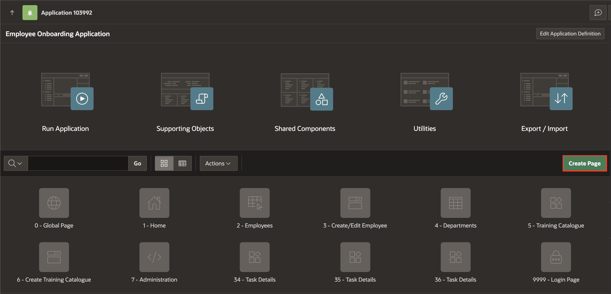

3. Select **Form**.

    

4. For Page Attributes, enter/select the following:

    - Page Definition > Name: **New Employee - Onboarding**

    - Data Source > Table/View Name: **EMPLOYEES**

    - Navigation > Breadcrumb Parent Entry: **Home (Page 1)**

     Click **Next**.

    

5. Select Primary key column 1 : **EMPLOYEE_ID (Number)**.
    Click **Create Page**.

    

6. In the Page Designer, in the rendering tree, select **New Employee - Onboarding** region and in the property editor, make the following changes:

    - Under Appearance:
        - Template Options: In the pop-up box
            - Header: **Hidden**

            Click **Ok**.

    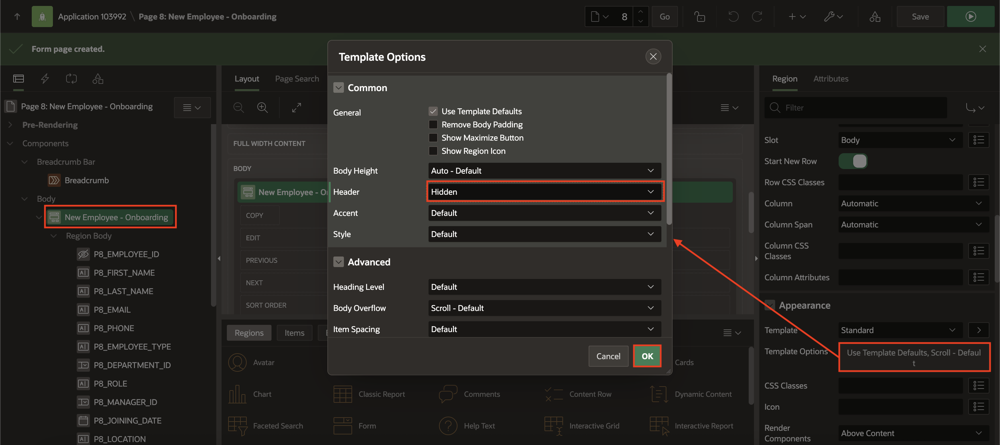

7. In the rendering tree, under **New Employee - Onboarding** region and select **P8\_LAST\_NAME**.

     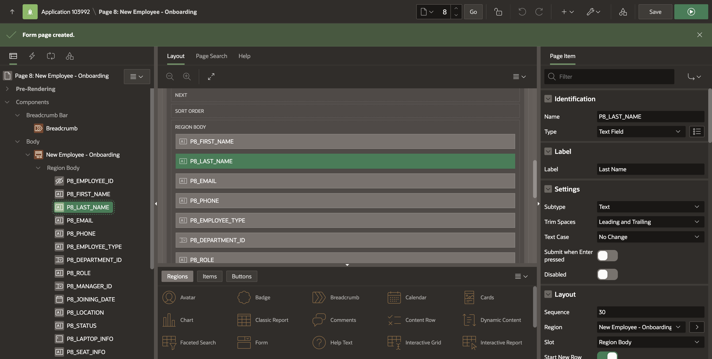

8. In the property editor, under Layout > Start New Row : **Toggle OFF**.

     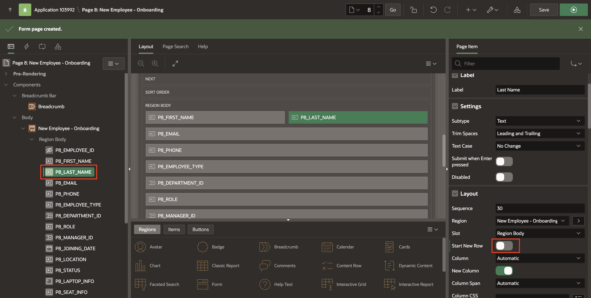

9. Similarly, do the same for following 4 Page Items:
    - **P8\_PHONE**
    - **P8\_DEPARTMENT\_ID**
    - **P8\_MANAGER\_ID**
    - **P8\_LOCATION**

     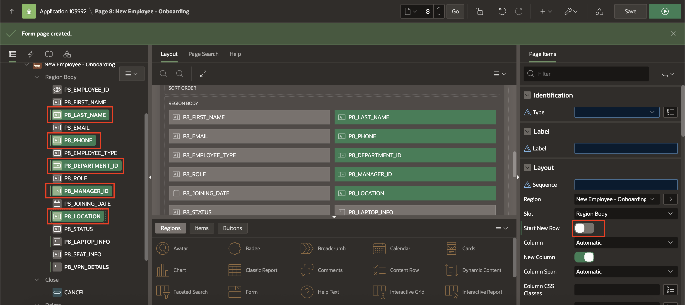

10. Select **P8\_STATUS**, **P8\_LAPTOP\_INFO** , **P8\_SEAT\_INFO** and **P8\_VPN\_DETAILS**, and in the property editor, set Identification > Type: **Hidden**

    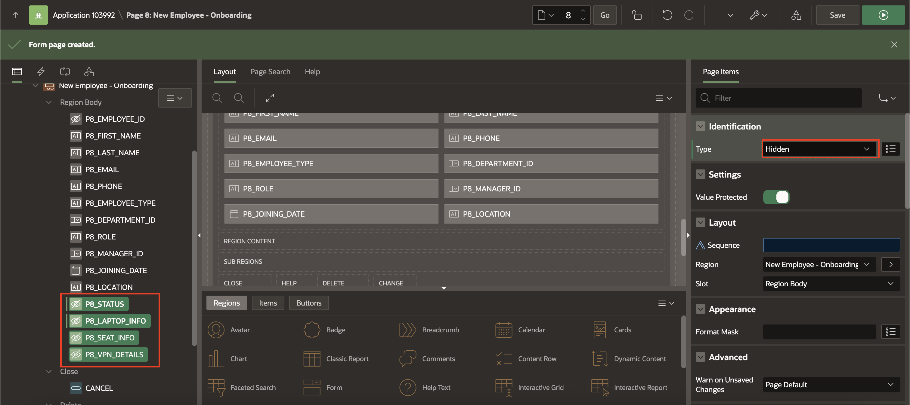

11. Select **P8\_EMPLOYEE\_TYPE**, in the property editor, enter/select the following:

      - Identification > Type: **Select One**

      - Apperance > Template: **Required - Floating**

      - Validation > Value - **Toggle ON**

      - Under List of Values:
        - Type: **Static Values**
        - Static Values: enter the following

            |Display Value | Return Value |
            |----------|-------|
            | Full-Time | Full Time  |
            | Intern | Intern |
            {: title="List of Static Values to be Created"}

            Click **Ok**.

        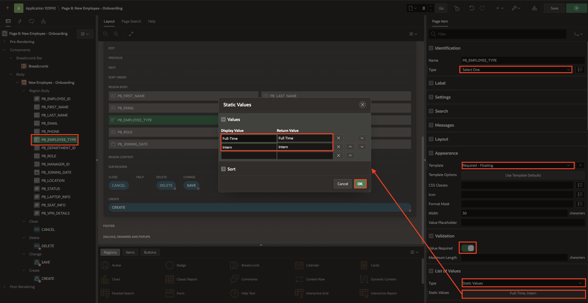

12. In the rendering tree, select **P8\_EMAIL** item and in the property editor, set the Label > Label as **Personal Email**.

    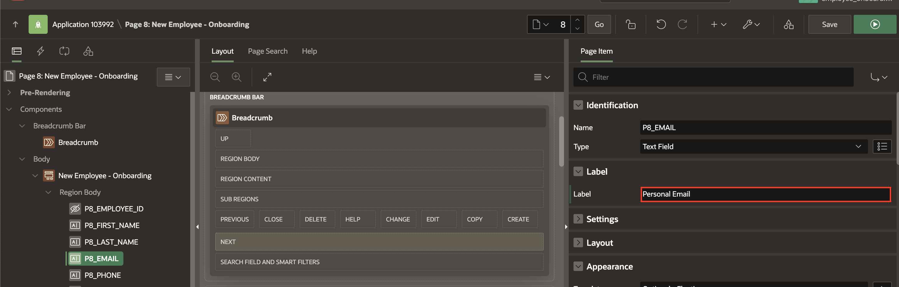

13. Select **P8\_FIRST\_NAME**, **P8\_EMAIL** , **P8\_DEPARTMENT\_ID**, and **P8\_MANAGER\_ID** and **P8\_JOINING\_DATE**, in the property editor, select the following:

    - Apperance > Template: **Required - Floating**

    - Validation > Value Required - **Toggle ON**

    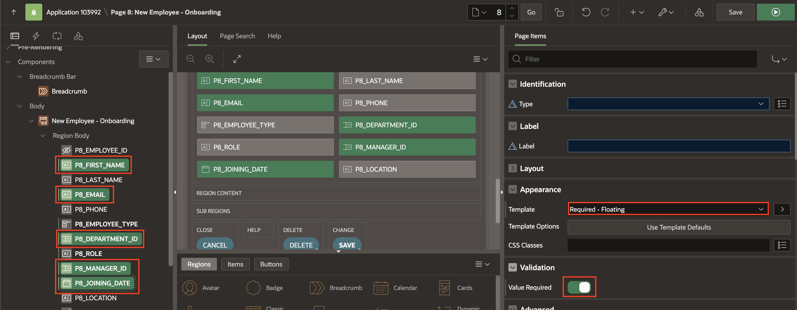

14. Select **P8\_DEPARTMENT\_ID** and in the property editor, set Identification > Name: **Department**

    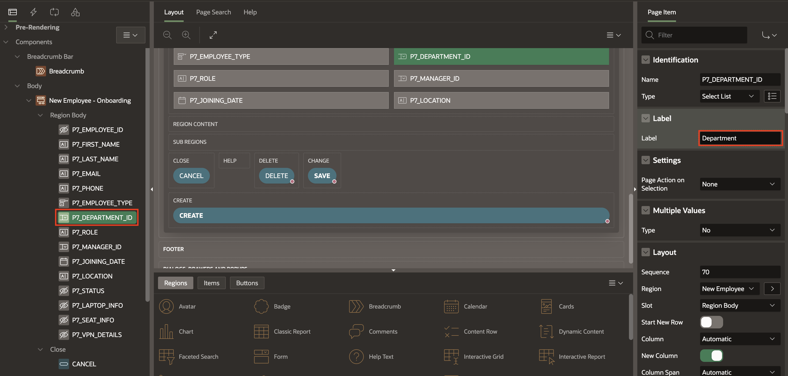

15. Similarly, select **P8\_MANAGER_\_ID** and in the property editor, set Label > Label: **Department**

    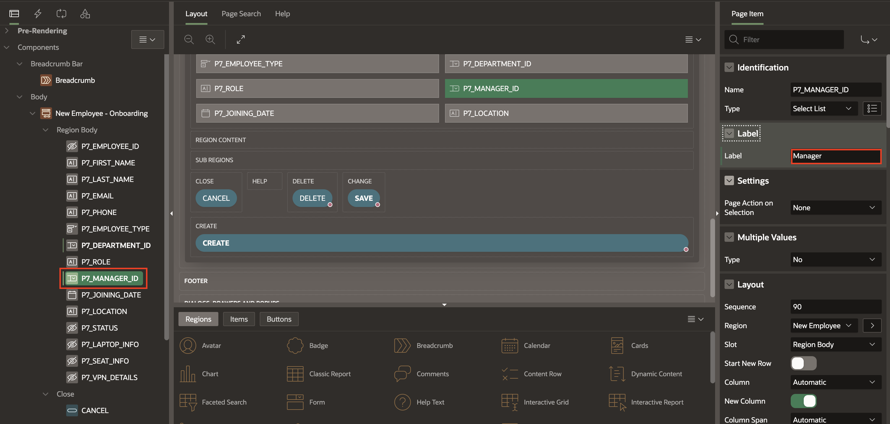

16. Click **Save**.

    

## Task 2: Create and Configure Page Process

1. Navigate to the **Processing** tab.

2. Under **Processing** tab, right-click **Processing** and select **Create Process**.

    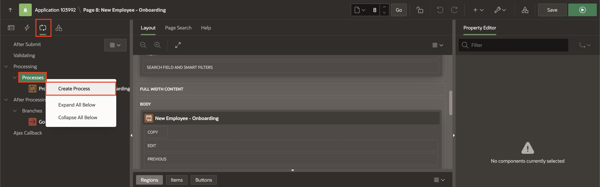

3. In the property editor, enter/select the following:

      - Under Identification:

          - Name: **Initiate Employment Type Workflow**

          - Type: **Workflow**

      - Under Settings:

          - Definition: **Employee Onboarding**

          - Details Primary Key Item: **P8\_EMPLOYEE\_ID**

      - Success message: **Employee Onboarding Initiated**

     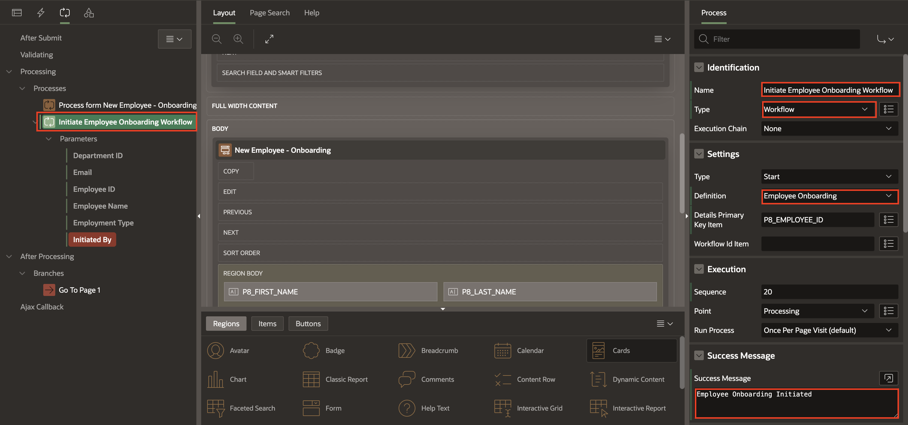

4. Now, configure Parameters for the Workflow Page Process. Update the following **Parameters** one after the other:

    | Parameter |  Type  | Item |
    | --- |  --- | ---- |
    | Email | Item | P8\_EMAIL |
    | Employee ID | Item | P8\_EMPLOYEE\_ID |
    | Employee Name | Item | P8\_FIRST\_NAME |
    | Employment Type | Item | P8\_EMPLOYMENT\_TYPE |
    {: title="List of Parameters to be linked"}

    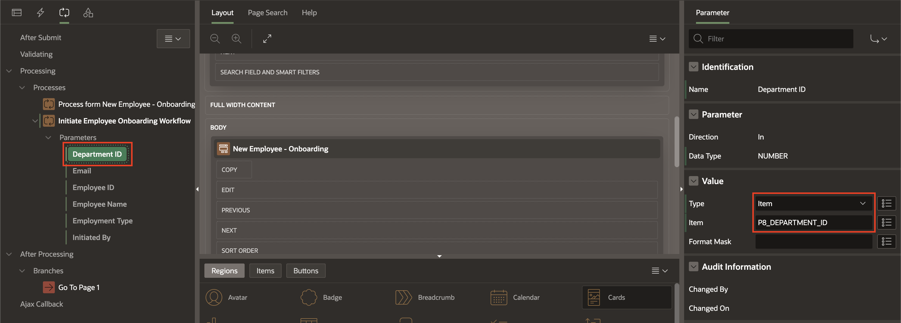

5. Click **Save**.

    

## Task 3: Create Tasks Page

1. Click **+ (Plus) Icon** on the top-right corner of the page designer. Select **Page** from the drop-down.

    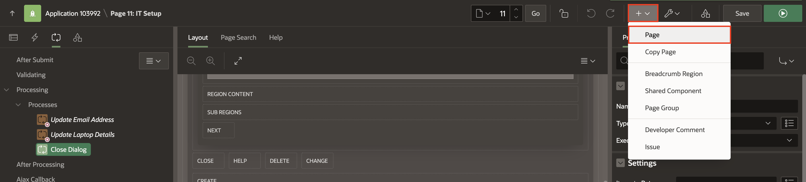

2. Select **Unified Task List**.

   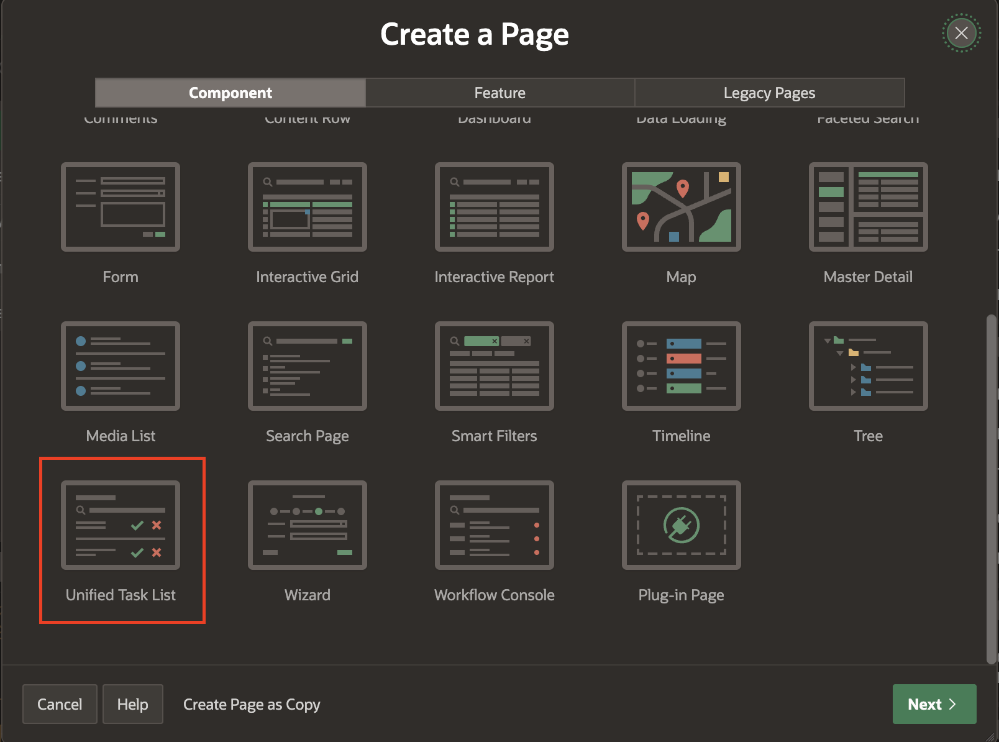

3. Specify the following page attributes:

    - Name: **My Tasks**

    - Report Context: **My Tasks**

    Click **Create Page**.

    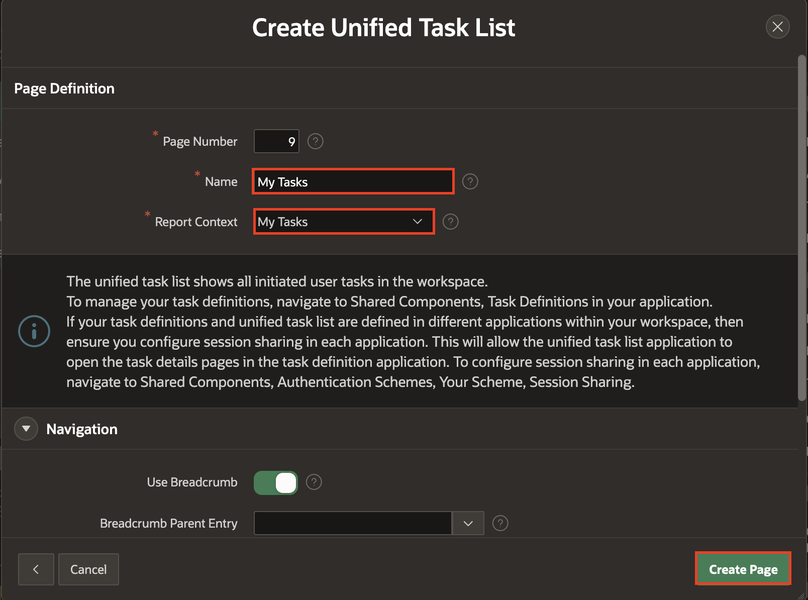

4. Our application has 1 entry point for IT teams. IT need to log in to create an email and allocate a laptop for the new hire. For this, you will create a IT Tasks page. This will also be a Unified Task List page for IT team to act on the tasks assigned to them.

5. To create another Unified Task list page, click **+ (Plus) Icon** on the top-right corner of the page designer toolbar. Select **Page** from the drop-down.

    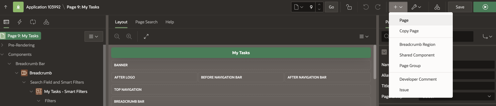

6. Select **Unified Task List**.

    

7. Specify the following page attributes:

    - Name: **Tasks Initiated by Me**

    - Report Context: **My Tasks**

    Click **Create Page**.

    

8. Click **Save**.

    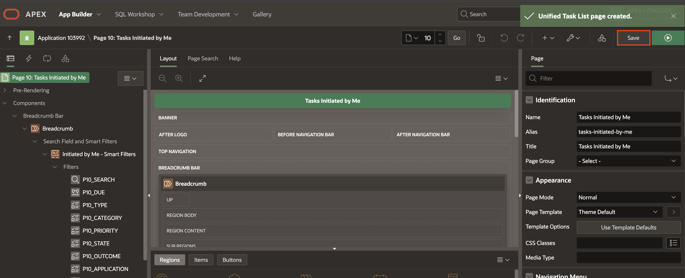

## Task 4: Create Initiated By Me Workflow Page

Finally, we need the page that the HR will use to monitor the employee onboarding workflow.

We use the Workflow Console and Details pages with **Initiated By Me** report context, which allows a logged-in user to view all Workflows Initiated by him or her.

> **Note:** The Workflow Console allows workspace users to view and manage their workflow instances, including My Workflows for workflow owners, Admin Workflows for workflow administrators, and Initiated by Me for workflow initiators. When configuring the Workflow Console, you have different Report Contexts to choose from. 

1. To create the Workflow Console and Details pages, click **+ (Plus) Icon** on the right-above corner of the page designer. Then, select **Page** from the drop-down, select **Create Page**.

2. Select **Workflow Console**.

    

3. In the Create Workflow Console wizard, enter/select the following:

    - Under Page Definition:

        - Name: **Workflows Initiated By Me**

        - Report Context: **Initiated By Me**

        - Include Dashboard Page: **Toggle On**

        - Dashboard Page Name: **Workflow Dashboard**

        - Form Page Name: **Initiated By Me Form**. This is used for the Workflow Details page.

    Click **Create Page**.

    

4. Save the page.

    

## Task 5: Create My Workflows Page

1. To create the Workflow Console and Details pages, click **+ (Plus) Icon** on the right-above corner of the page designer. Then, select **Page** from the drop-down., select **Create Page**.

    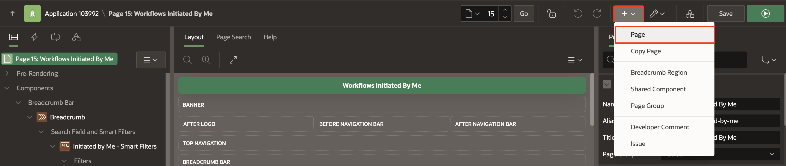

2. Select **Workflow Console**.

    

3. In the Create Workflow Console wizard, enter/select the following:

    - Under Page Definition:

        - Name: **My Workflows**

        - Report Context: **My Workflows**

        - Form Page Name: **My Workflows Me Form**. This is used for the Workflow Details page.

    Click **Create Page**.

    

4. Click **Save and Run** and navigate through different pages to demonstrate the workflow, tasks, and feedback functionalities.

## Task 8: Improve Navigation Menu

1. On the top right, select the **Shared Components icon**.

    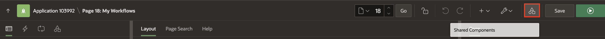

2. Under **Navigation and Search**, select **Navigation Menu**.

    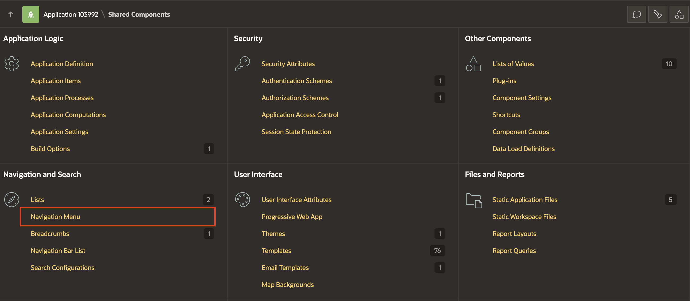

3. Select **Navigation Menu**.

    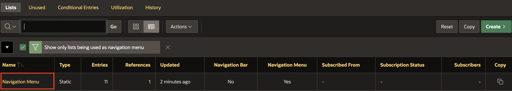

4. Under **List Entries**, select **Create List Entry**.

    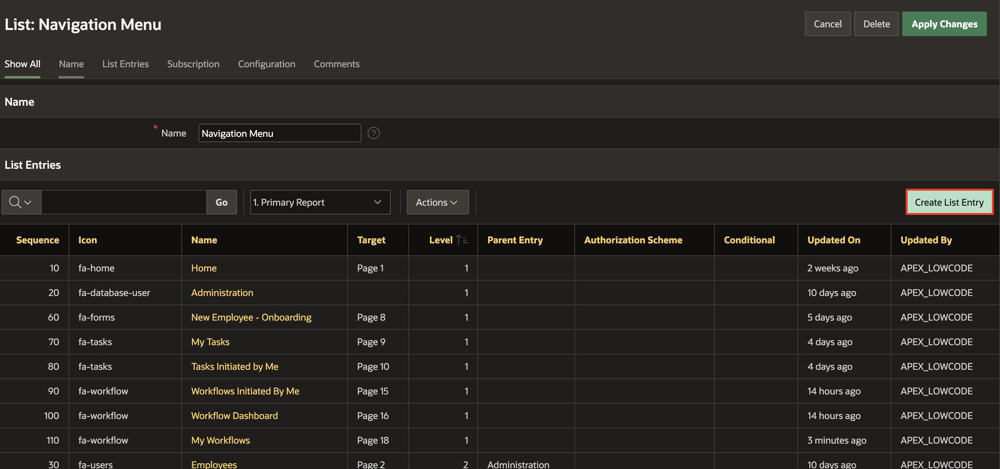

5. Enter/select the following:

    - Under Entry:
        - Image/Class: **fa-tasks-alt**
        - List Entry Label: **Task Pages**

    - Target > Target Type: **- No Target -**

    Click **Create List Entry**.

    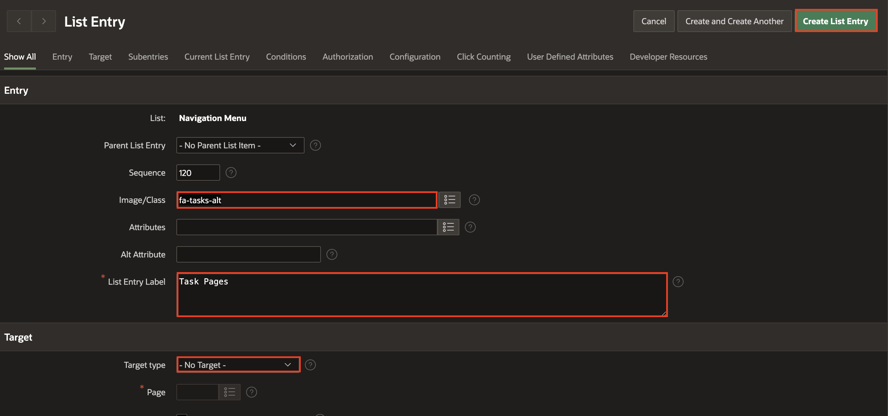

6. Similarly, create another entry with the following properties:

    - Under Entry:
        - Image/Class: **fa-workflow**
        - List Entry Label: **Workflow Pages**

    - Target > Target Type: **- No Target -**

    Click **Create List Entry**.

    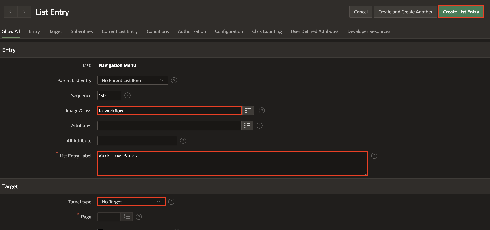

7. Now, select **Tasks Initiated by Me**, **My Tasks** and update Parent List Entry to **Workflow Pages**. Click **Apply Changes**.

    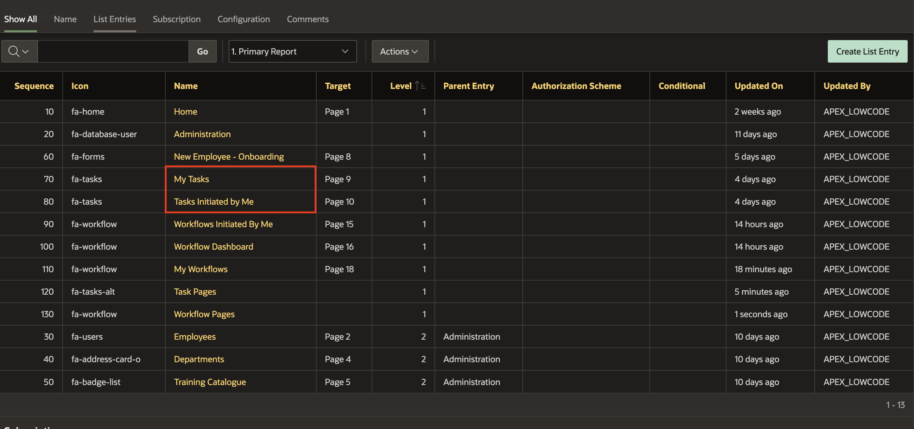

    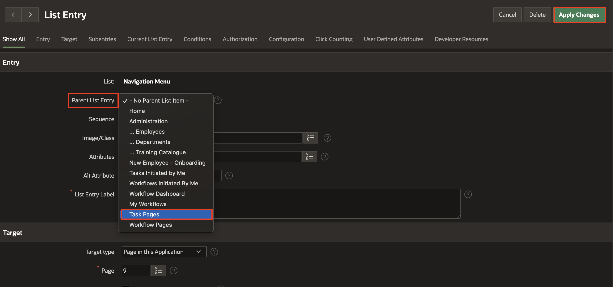

8. Similarly, select  **Workflows Initiated by Me**, **Workflow Dashboard**, **My Workflows** and update Parent List Entry to **Workflow Pages**. Click **Apply Changes**.

    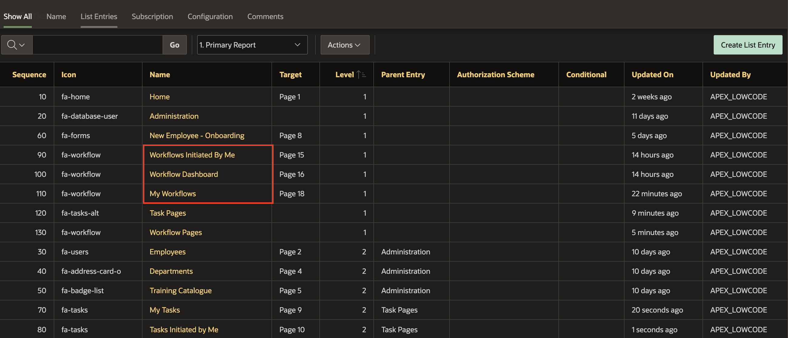

    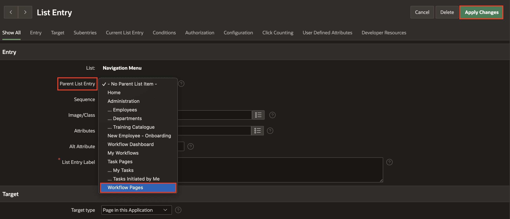

9. Now, select **Administration** list entry and set the Sequence: **150** and select **Apply Changes**.

    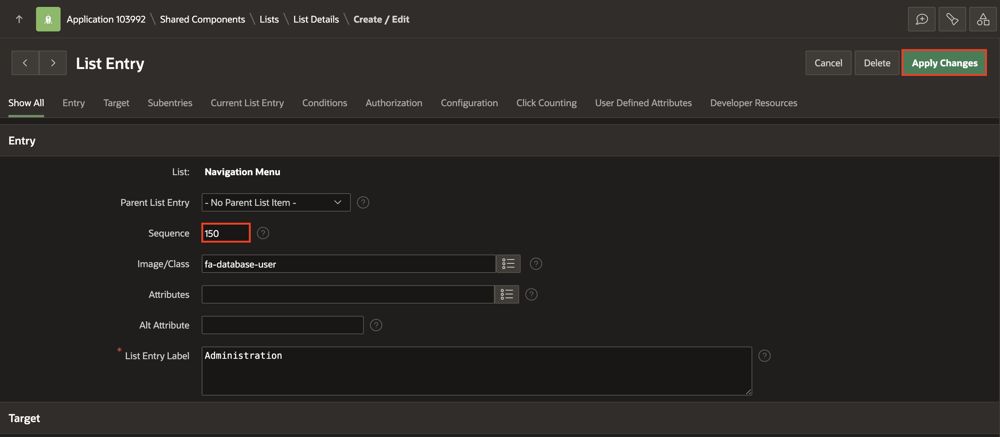

## Summary

You have successfully created a comprehensive Oracle APEX application for Onboarding New Employees with workflows and task lists.

## Acknowledgements

- **Author** - Roopesh Thokala, Senior Product Manager; Sahaana Manavalan, Senior Product Manager, August 2025
- **Last Updated By/Date** - Sahaana Manavalan, Senior Product Manager, August 2025