# Use the Create Application Wizard

## Introduction

In this lab, you will create an interactive Project Management application using Create Application using Generative AI. The application will be built using the Sample Dataset you generated in the previous lab, providing a practical foundation for your project.

Estimated Time: 15 minutes

### Objectives
- Create an application using the AI-driven Create Application wizard with the Data Model created in the previous Lab

### What You will Need

- An Oracle Cloud paid account, or free trial.
- Project Data model created using Generative AI.

## Task 1: Create the Application using Generative AI

1. From your APEX workspace homepage, click **App Builder**.

    

2. Click **Create**.
    

3. In the Create an Application Page, Select **Create APP Using Generative AI**

    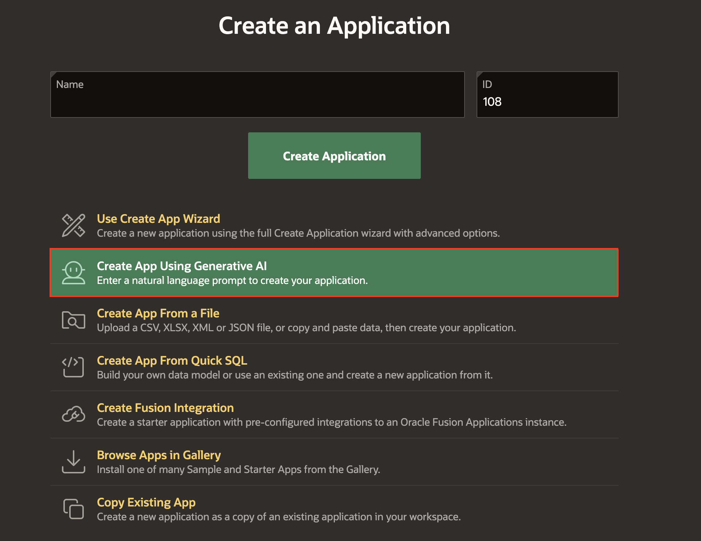

4. In the APEX Assistant Wizard, if you see a warning that says "It looks like there are some changes to tables in your workspace. Please refresh the data dictionary cache to work with the latest tables". Click on **Accept** and then click **Refresh Cache**.

     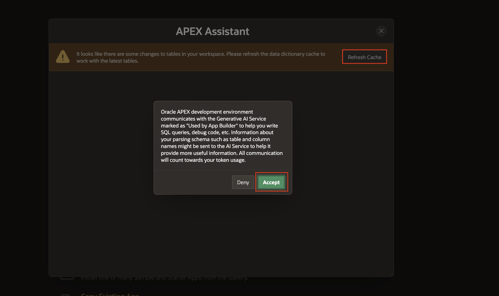

5. Use the APEX Assistant Wizard to create an Application, to create a Project Management Application, enter the prompt mentioned below and hit **Enter**.

    >Prompt 1:
    >Create an application with Projects, Milestones, Status, Tasks, To-Dos, Links, and Comments. Enable Progressive Web App and Feedback features.

    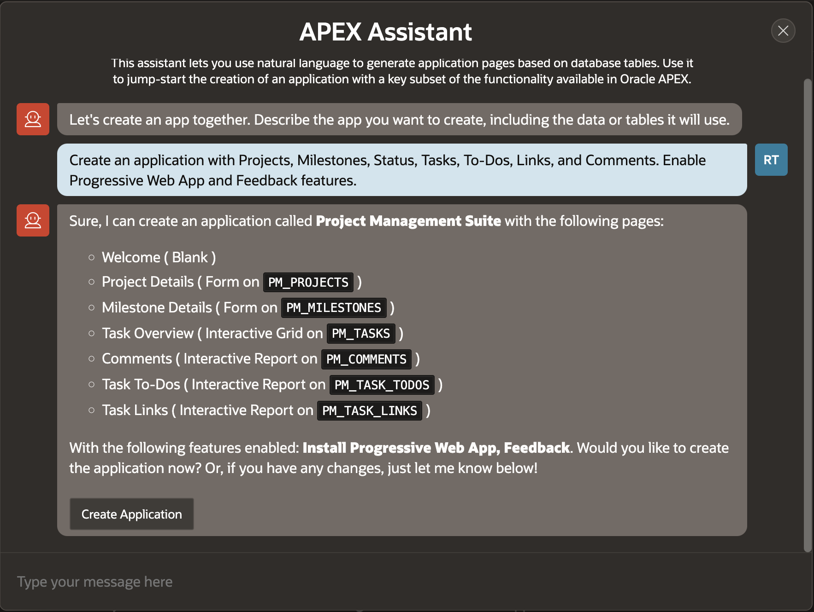

6. Now, we need set the Project Details page as Interactive report and convert the Milestones Page into Interactive Grid.

    >Prompt 2:
    >Set the Project Details page as an Interactive Report with a Form and the Milestones page as an Interactive Grid

    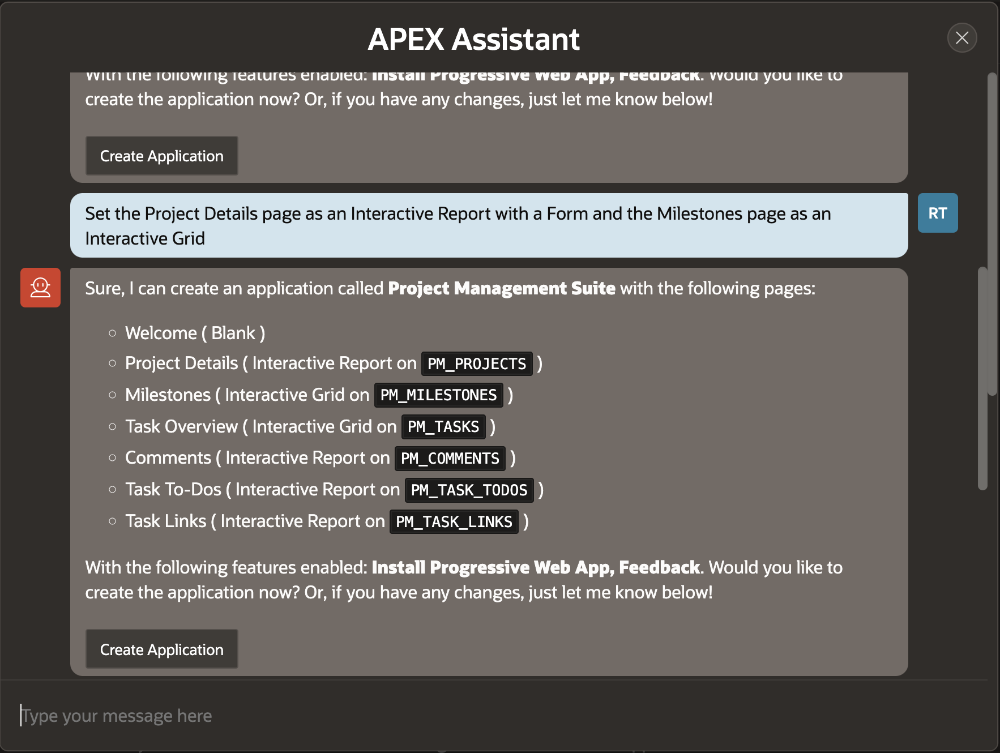

7. Similarly, you need to add a new page for Project Dashboard and make it a Homepage. Also, you will be removing the exiting Home page which is marked as Welcome Page.
    >Prompt 3:
    >Add a project dashboard as a Cards page, set it as the Home page, and remove the Welcome page

    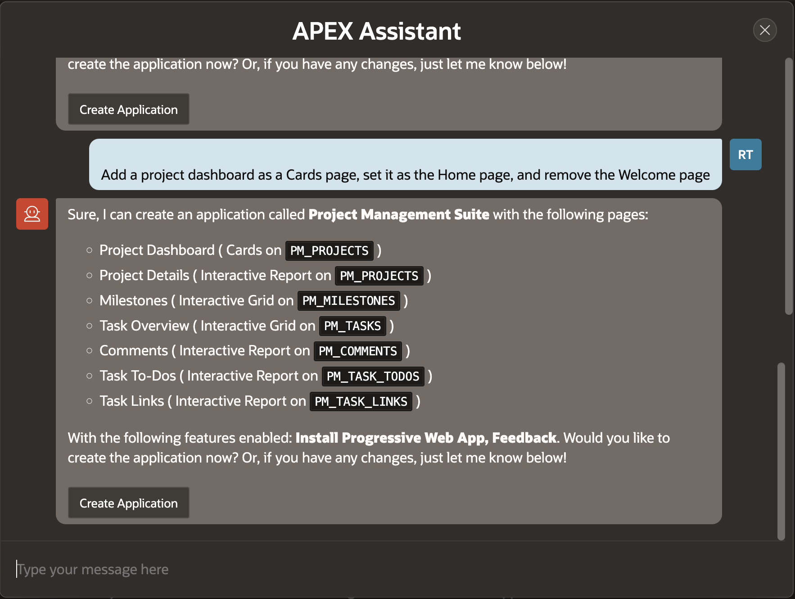

9.  Finally, set the Project Dashboard Page as a Cards region and click **Create Application**.

    >Prompt 6:
    >Set the Task Overview page as an Interactive Report with a Form

    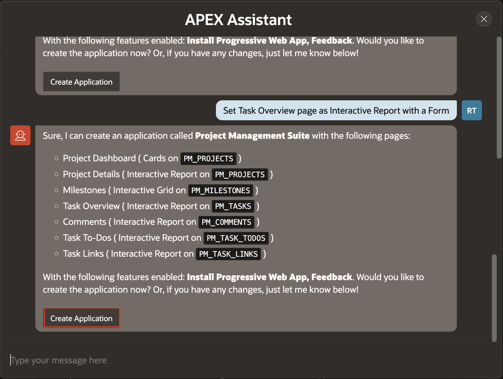

> **Note:** _The pages might differ based on the prompt. Make sure that you have **Project Dashboard page defined as Cards Region**, **Project Tasks to-dos, and Links pages created as Interactive report with a Form** by giving appropriate prompts_

10. On the Create an Application page, click **Appearance** Icon.

    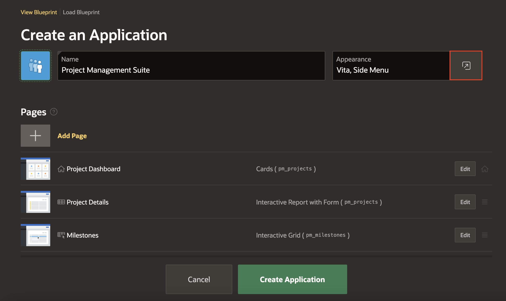

11. In the Appearance Wizard, Select **Redwood Light** and then click **Save Changes**.

    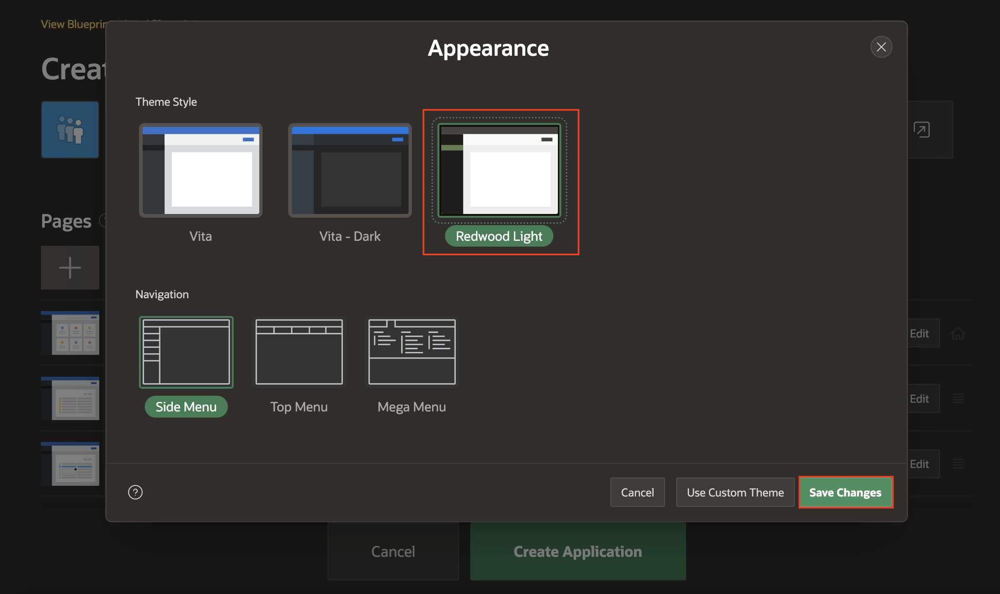

12. Make sure that the **Progressive Web App** and **Feedback features** are enabled. Then, click **Create Application**.

    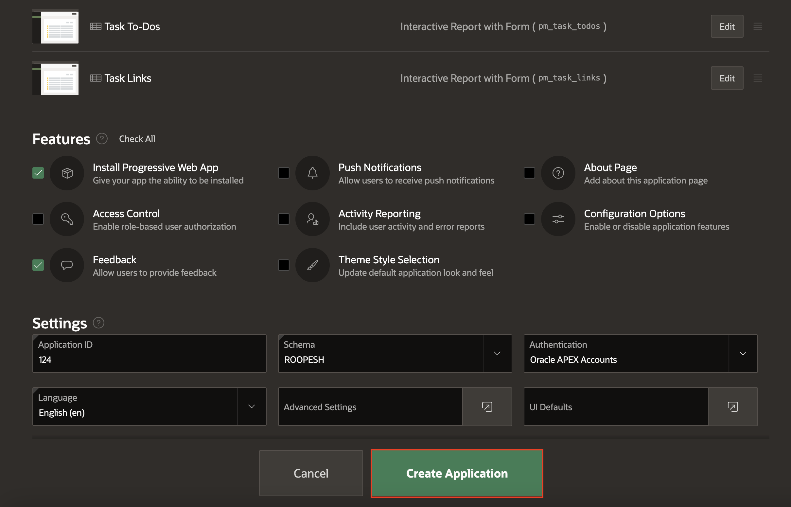

## Task 2: Run the Application

1. Your new application will be displayed in Page Designer. Click **Run Application**.

    

2. In the runtime environment, the login page will be displayed.

    Enter your **Username** and **Password** (Username should be Demo).   
    Click **Sign In**.

    The new application will be displayed.

    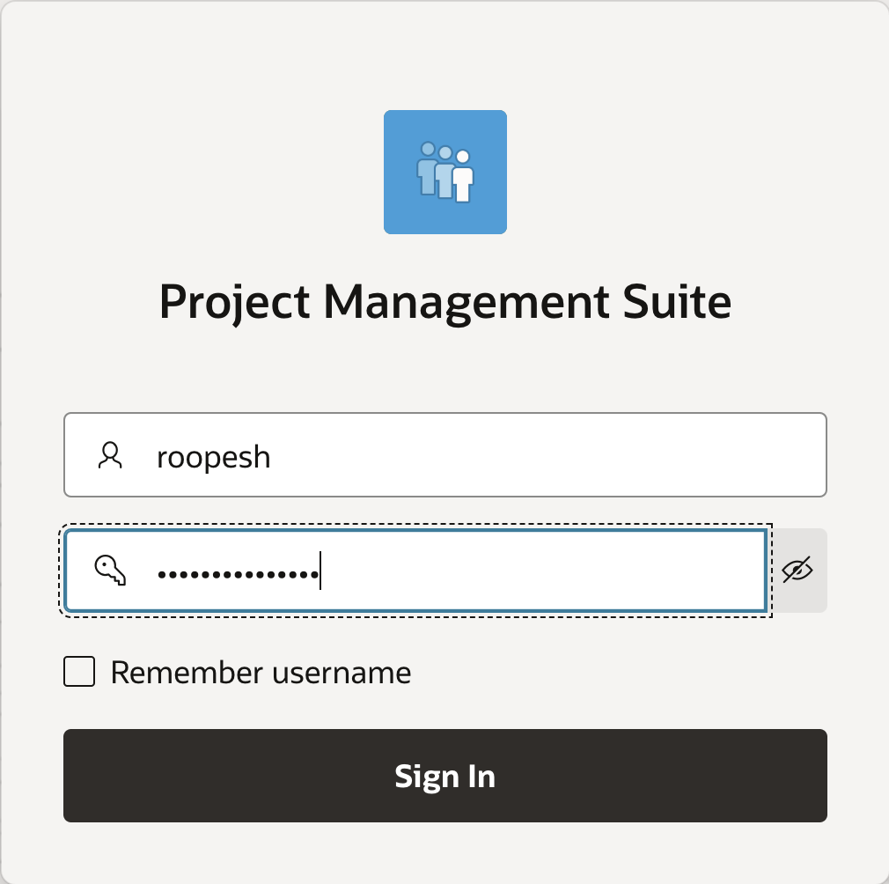

3. Play around with the application and explore the different pages.

    Records are displayed in all of the reports which makes page review significantly easier, especially for reports. The fact that the data may not be exactly correct for the columns is not critical, as you can very easily update the data to make it more realistic.

    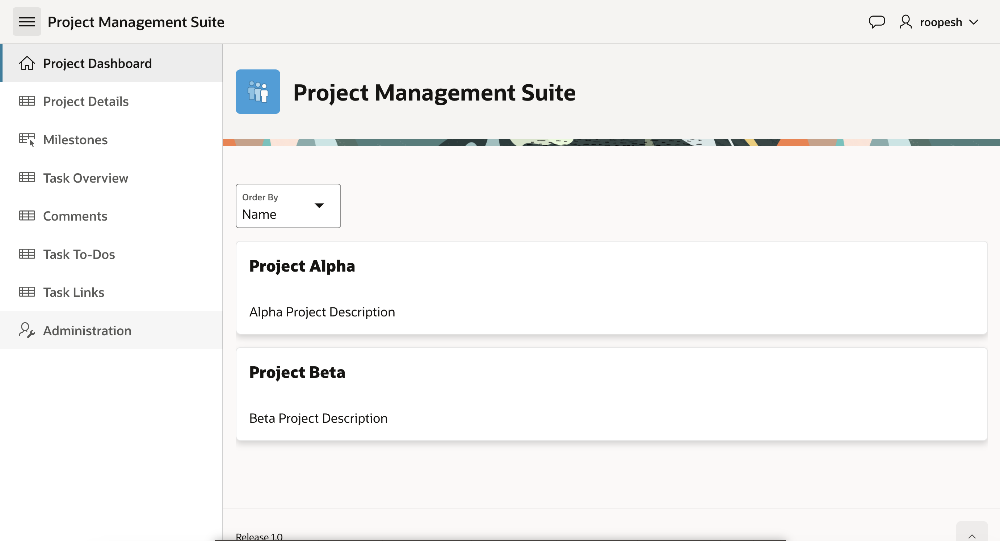

## **Summary**
You now know how to utilize Generative AI to create the first cut of your application.

## **Acknowledgments**

- **Author** - Roopesh Thokala, Senior Product Manager
- **Last Updated By/Date** - Roopesh Thokala, Senior Product Manager, January 2025
